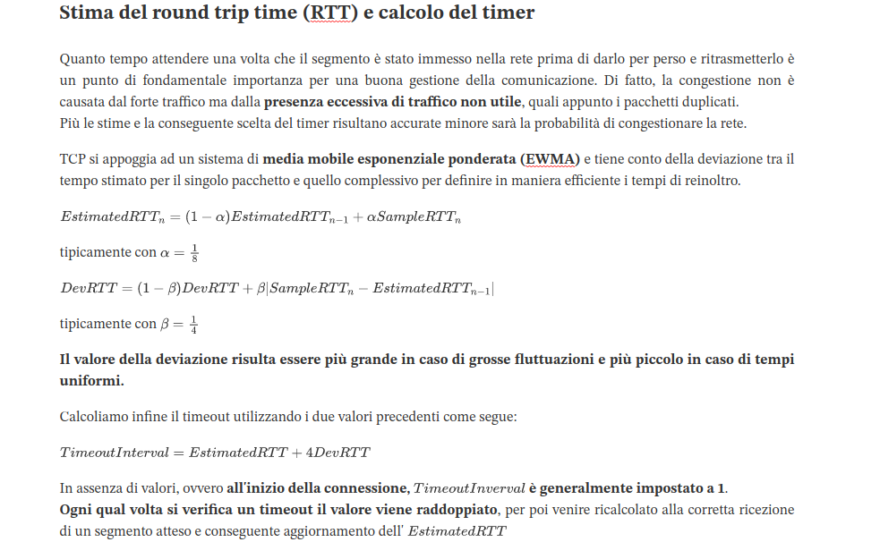

## Appunti di reti di calcolatori
Università degli studi di Catania.\
L-31. A.A.2021/2022.

Un misto di appunti presi a lezione, nozioni di vari libri di testo, considerazioni personali qualche risposta trovata in giro per il web.\
Perfettamente fallibili, non sempre chiari e estremamente improntati al mio metodo di studio.

Eventuali contributi e segnalazioni sono ben accetti.

### Indice degli argomenti:

1. [Stack di rete - TCP/IP e ISO/OSI](stacks.md)
2. [Livello applicativo](applicativo.md)
3. [Livello di trasporto](trasporto.md)

### Note sull'utilizzo:

Essendo scritti in markdown gli appunti sono facilmente consultabili ed editabili, per una fruizione ottima si consiglia però l'utilizzo di [Typora](https://typora.io/), software con cui sono stati scritti. Sono stati impaginati utilizzando il tema [Academic](https://theme.typora.io/theme/Academic/) come riferimento. Seguendo questi due riferimenti è possibili esportarli in PDF con una struttura del tutto identica a quella usata attualmente. Utilizzando altri editor e temi potrebbero esserci leggere variazioni.

