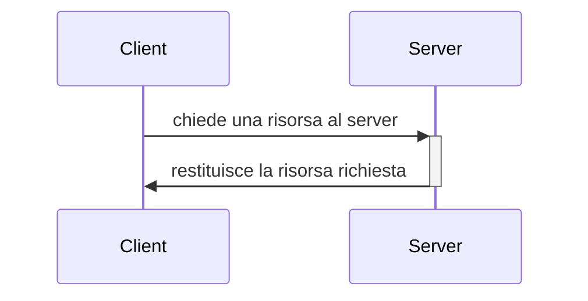

# LIVELLO APPLICATIVO

Il livello applicativo si posiziona al 7° posto (ultimo), a partire dal basso, nello stack teorico OSI.
Nello modello TCP/IP, che è lo standard *de facto* di Internet, è invece posizionato al 5° (e ultimo) posto.
È bene ricordare che la separazione in layer adottata dal TCP/IP non è netta come viene generalmente rappresentata.

L'idea generale per cui ogni livello si basi esclusivamente sulle funzionalità offerte dal sottostante e ne offra al successivo quindi non si sposa perfettamente con l'implementazione pratica, tuttavia è abbastanza attendibile da venire utilizzata come riferimento quando si analizza questo stack dal punto di vista accademico.

I software di utilizzo comune si interfacciano principalmente con il livello applicativo e sfruttano per svolgere le proprie mansioni i servizi da questo offerti. Un esempio calzante potrebbe essere quello di un qualsiasi browser che utilizza l'implementazione del protocollo HTTP/HTTPS per dialogare con un qualsiasi web server.

## Architettura delle applicazioni in rete

Quando si parla di architettura delle applicazioni si intende il modello secondo cui un applicativo è (deve o dovrà essere) sviluppato. Il flusso di dati all'interno dell'applicazione, il tipo di servizio offerto, i pattern secondo cui il software è organizzato (e altro ancora) rappresentano l'architettura dell'applicazione. I dettagli riguardanti l'implementazione delle funzionalità dei livelli sottostanti nonché lo stack su cui la nostra applicazione si poggia sono aspetti sicuramente intersezionali che influenzeranno il modo in cui essa verrà nel concreto sviluppata, tuttavia non rientrano nel core dell'architettura dell'applicazione.

Principali architetture:

- client - server
- peer-to-peer (P2P)

### Struttura e utilizzo dell'architettura client-server: overview

**Server**: l'host che su richiesta fornisce il servizio/le risorse. Dovendo essere sempre raggiungibile[^1] ha un *indirizzo permanente*.
Solitamente i server sono organizzati in data center e replicati in differenti locazioni geografiche per garantire tolleranza ai guasti e efficienza (vicinanza e distribuzione del carico).

**Client**: l'host che richiede la risorsa. Non necessita di essere sempre attivo e raggiungibile e proprio per questo motivo tipicamente ha un indirizzo *dinamico*. In un architettura di tipo client-server se sono presenti più client la comunicazione non avviene in maniera diretta ma comunque passa attraverso il server (cosa che avviene ad esempio in applicazioni come Discord, Slack o Teams).



In applicazioni reali alcuni client possono a loro volta fornire servizi a terzi e alcuni server possono richiedere a loro volta servizi e risorse. Un esempio abbastanza concreto, pur non essendo un applicazione di rete, è *XWayland*, un X server per le applicazioni che seguono il protocollo Xorg che è a sua volta client del server grafico Wayland.

### Struttura e utilizzo dell'architettura P2P: overview

Nell'architettura P2P i nodi, detti appunto peer (pari), compongono una rete. Ogni peer richiedere e fornisce risorse/servizi (a seconda delle sue disponibilità) agli altri, con cui comunica direttamente.
I peer sono per lo più host ordinari, hanno quindi indirizzi dinamici e non è necessario che siano sempre attivi.
Un esempio di utilizzo dell'architettura P2P sono i programmi di file sharing come *µTorrent* e *Transmission*, entrambi client *BitTorrent* (protocollo P2P).

### Architettura client-server e P2P a confronto

Un architettura distribuita come quella P2P è estremamente scalabile ma anche molto complessa da gestire, al contrario invece un'architettura client-server è più semplice da gestire ma meno scalabile. 

Ad oggi la maggioranza delle applicazioni in rete è sviluppata seguendo l'approccio client-server, in linea con la predilezione storica per la semplicità che *funziona quanto basta* di questo tipo di contesto.
Nonostante ciò è in crescita l'interesse per le tecnologie distribuite.[^2]

### Protocolli di livello applicativo di tipo client-server: alcuni esempi

| Protocollo | Ambito di utilizzo                                           |
| ---------- | :----------------------------------------------------------- |
| HTTP/HTTPS | Web                                                          |
| FTP/TFTP   | Download dei file                                            |
| IMAP       | Posta, tipo pull                                             |
| POP        | Posta, tipo pull                                             |
| SMTP       | Posta, tipo push                                             |
| Telnet     | Sessioni da remoto                                           |
| SSH        | Sessione da remoto + sicurezza                               |
| DNS        | Risoluzione degli indirizzi                                  |
| BOOTP      | Assegnazione degli indirizzi e caricamento delle immagini del SO |
| DHCP       | Assegnazione degli indirizzi nelle reti locali, ha sostituito BOOTP |
| TSL/SSL    | Sicurezza                                                    |
| IRC        | Chat                                                         |
| SIP        | Gestione della sessione                                      |
| SNMP       | Configurazione e monitoring di rete                          |
| OpenPGP    | Sicurezza                                                    |

## Socket

### Overview

Se all'interno del sistema operativo stesso processi differenti comunicano attraverso strutture condivise, con il supporto degli strumenti di IPC, la comunicazione su processi che risiedono su sistemi differenti avviene invece secondo un paradigma basato sullo *scambio di messaggi*, inoltrati sulla rete.

Essendo la rete una struttura esterna alle macchine, su cui quindi esse non hanno controllo, l'inoltro di un messaggio è spesso paragonato all'uscire da una porta o allo spedire una lettera.

La socket è l'interfaccia tra la macchina e la rete. Volendo incalzare il paragone precedente potremmo identificarla come la soglia della porta di casa o la nostra casella postale.

Una porta in sé non ha un particolare significato ma la stanza che vi si trova dietro può invece essere di particolare interesse a seconda del proprio scopo. 

Supponiamo di avere un edificio particolarmente grande, ad esempio un ufficio, dove le porte sono numerate secondo una certa semantica, e uno stagista inesperto che non sappia come raggiungere la scrivania del proprio supervisore. Volendo dotare lo stagista di una socket per rendegli più facile la vita gli diremo che dietro la porta A21 di colore bianco del secondo piano, ad esempio, c'è la scrivania che cerca. Il secondo piano costituisce quindi l'indirizzo che identifica la sezione dove lavorerà, mentre la porta A21 identifica l'ufficio all'interno del piano. Dandogli solo uno dei tre parametri difficilmente riuscirà a trovare la scrivania del proprio supervisore, visto che esistono numerose stanze al secondo piano, molte di colori differenti, e magari la stanza A21 si può trovare su più piani.

Il precedente è un buon esempio discorsivo della così detta *socket a tre parametri*.
Essendo la socket un concetto astratto ne esistono varie interpretazioni, alcune più canoniche di altre.

Tralasciando lo zucchero sintattico introdotto fino a questo punto, presentiamo la socket come una *API* (o interfaccia che dir si voglia), dunque un *oggetto software* che fornisce astrazioni e che assolve il ruolo di *identificare univocamente un processo all'interno di una specifica macchina* in modo tale che sia raggiungibile anche dall'esterno.

### Socket a tre parametri

Una delle rappresentazioni più semplici della socket è quella dell'oggetto software a *tre parametri*:

- *indirizzo della macchina*
- *numero porta a cui il processo è collegato*
- *tipo della socket*

L'indirizzo della macchina unito al numero di porta permettono un'identificazione univoca del processo. Il tipo invece descrive le modalità secondo cui la comunicazione deve avvenire.

Questo tipo di rappresentazione prende però in considerazione una sola delle due macchine, dando quindi una visione parziale della comunicazione.

### Socket di Berkeley a cinque parametri

La seconda e più completa rappresentazione delle socket è quella a cinque parametri:

- *indirizzo del mittente*
- *numero di porta del processo sull'host mittente*
- *indirizzo del destinatario*
- *numero di porta del processo sull'host destinatario*
- *tipo della socket*

Qui il paragone con la porta di casa o la casella postale non è più così calzante visto che la socket è intesa più come le *estremità di un canale di comunicazione tra due host*.

*La struttura di Berkeley è quella maggiormente utilizzata nei sistemi reali e i dettagli tecnici a seguire fanno riferimento ad essa.*

[Ulteriori approfondimenti](https://en.wikipedia.org/wiki/Berkeley_sockets)

### Considerazioni

Un po' come una persona può possedere più di un bene immobile, anche un processo può avere più socket ad esso associate. Il viceversa richiede qualche considerazione in più.

Soprattutto sui sistemi UNIX ma non solo, essendo la socket intesa come un file, è spesso soggetta a tutti quei meccanismi di condivisione ed ereditarietà a cui si va incontro durante la generazioni di nuovi processi figli. Situazioni simili vanno opportunamente gestite al fine di evitare inconsistenze ma non sono tuttavia sempre illegali dal punto di vista del sistema operativo.

Azioni come la ```bind()```o la ```listen()``` ad esempio sono concesse esclusivamente al processo originale e non possono essere ripetute finché non viene effettuato un corrispettivo detach, tuttavia processi figli potrebbero effettuare operazioni di ```send()```o ```recv()``` sulla stessa socket senza particolari problemi.


[^1]: possono ovviamente manifestarsi dei disservizi di durata più o meno lieve per cui il server può risultare non raggiungibile 
[^2]: tecnologie basate su blockchain come le criptovalute o il web3