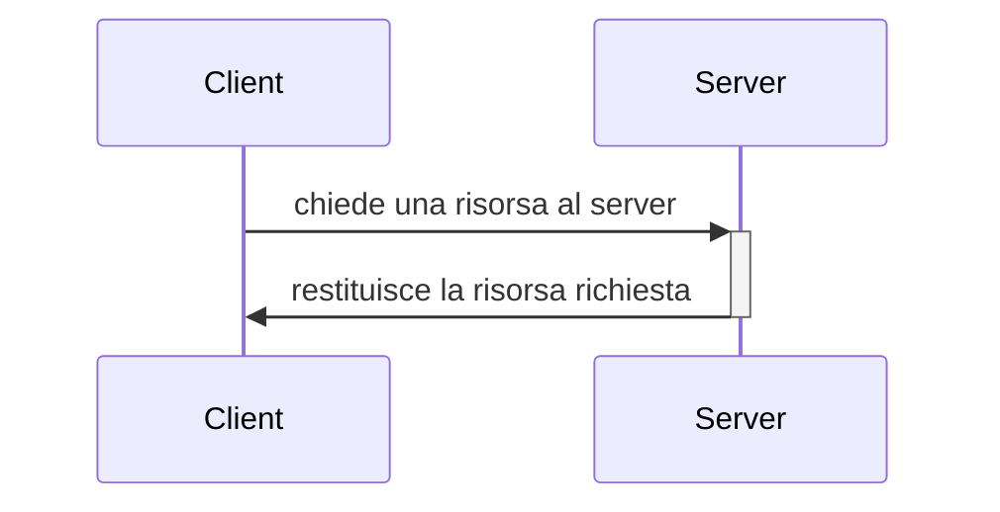
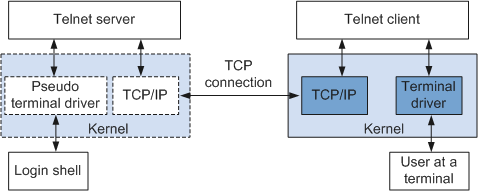
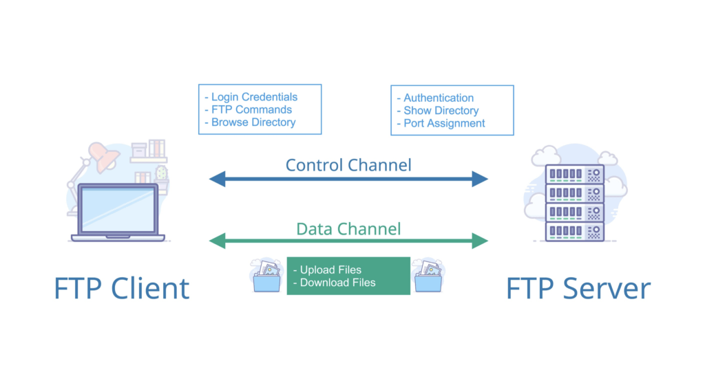
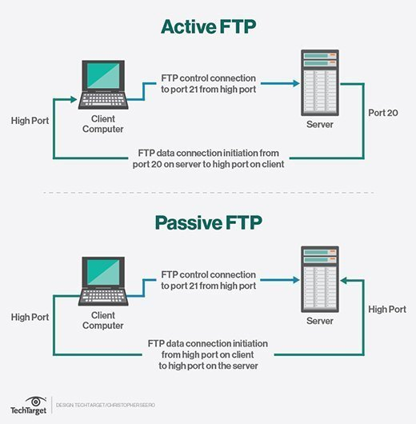

# LIVELLO APPLICATIVO

Il livello applicativo si posiziona al 7° posto (ultimo), a partire dal basso, nello stack teorico OSI.
Nello modello TCP/IP, che è lo standard *de facto* di Internet, è invece posizionato al 5° (e ultimo) posto.
È bene ricordare che la separazione in layer adottata dal TCP/IP non è netta come viene generalmente rappresentata.

L'idea generale per cui ogni livello si basi esclusivamente sulle funzionalità offerte dal sottostante e ne offra al successivo quindi non si sposa perfettamente con l'implementazione pratica, tuttavia è abbastanza attendibile da venire utilizzata come riferimento quando si analizza questo stack dal punto di vista accademico.

I software di utilizzo comune si interfacciano principalmente con il livello applicativo e sfruttano per svolgere le proprie mansioni i servizi da questo offerti. Un esempio calzante potrebbe essere quello di un qualsiasi browser che utilizza l'implementazione del protocollo HTTP/HTTPS per dialogare con un qualsiasi web server.

## Architettura delle applicazioni in rete

Quando si parla di architettura delle applicazioni si intende il modello secondo cui un applicativo è (deve o dovrà essere) sviluppato. Il flusso di dati all'interno dell'applicazione, il tipo di servizio offerto, i pattern secondo cui il software è organizzato (e altro ancora) rappresentano l'architettura dell'applicazione. I dettagli riguardanti l'implementazione delle funzionalità dei livelli sottostanti nonché lo stack su cui la nostra applicazione si poggia sono aspetti sicuramente intersezionali che influenzeranno il modo in cui essa verrà nel concreto sviluppata, tuttavia non rientrano nel core dell'architettura dell'applicazione.

Principali architetture:

- client - server
- peer-to-peer (P2P)

### Struttura e utilizzo dell'architettura client-server: overview

**Server**: l'host che su richiesta fornisce il servizio/le risorse. Dovendo essere sempre raggiungibile[^1] ha un *indirizzo permanente*.
Solitamente i server sono organizzati in data center e replicati in differenti locazioni geografiche per garantire tolleranza ai guasti e efficienza (vicinanza e distribuzione del carico).

**Client**: l'host che richiede la risorsa. Non necessita di essere sempre attivo e raggiungibile e proprio per questo motivo tipicamente ha un indirizzo *dinamico*. In un architettura di tipo client-server se sono presenti più client la comunicazione non avviene in maniera diretta ma comunque passa attraverso il server (cosa che avviene ad esempio in applicazioni come Discord, Slack o Teams).



In applicazioni reali alcuni client possono a loro volta fornire servizi a terzi e alcuni server possono richiedere a loro volta servizi e risorse. Un esempio abbastanza concreto, pur non essendo un applicazione di rete, è *XWayland*, un X server per le applicazioni che seguono il protocollo Xorg che è a sua volta client del server grafico Wayland.

### Struttura e utilizzo dell'architettura P2P: overview

Nell'architettura P2P i nodi, detti appunto peer (pari), compongono una rete. Ogni peer richiedere e fornisce risorse/servizi (a seconda delle sue disponibilità) agli altri, con cui comunica direttamente.
I peer sono per lo più host ordinari, hanno quindi indirizzi dinamici e non è necessario che siano sempre attivi.
Un esempio di utilizzo dell'architettura P2P sono i programmi di file sharing come *µTorrent* e *Transmission*, entrambi client *BitTorrent* (protocollo P2P).

### Architettura client-server e P2P a confronto

Un architettura distribuita come quella P2P è estremamente scalabile ma anche molto complessa da gestire, al contrario invece un'architettura client-server è più semplice da gestire ma meno scalabile. 

Ad oggi la maggioranza delle applicazioni in rete è sviluppata seguendo l'approccio client-server, in linea con la predilezione storica per la semplicità che *funziona quanto basta* di questo tipo di contesto.
Nonostante ciò è in crescita l'interesse per le tecnologie distribuite.[^2]

Un trattazione abbastanza interessante dei sistemi decentralizzati e del loro utilizzo ad oggi è disponibile [qui](https://www.gitbar.it/episodes/ep-119-insogna-ipfs).
È inoltre possibile trovare un esempio di applicazione decentralizzata (o DApp) in questo [repository](https://github.com/TendTo/Appunti-Blockchain/tree/master/smart-contracts) Github.

### Protocolli di livello applicativo di tipo client-server: alcuni esempi

| Protocollo | Ambito di utilizzo                                           |
| ---------- | :----------------------------------------------------------- |
| HTTP/HTTPS | Web                                                          |
| FTP/TFTP   | Download dei file                                            |
| IMAP       | Posta, tipo pull                                             |
| POP        | Posta, tipo pull                                             |
| SMTP       | Posta, tipo push                                             |
| Telnet     | Sessioni da remoto                                           |
| SSH        | Sessione da remoto + sicurezza                               |
| DNS        | Risoluzione degli indirizzi                                  |
| BOOTP      | Assegnazione degli indirizzi e caricamento delle immagini del SO |
| DHCP       | Assegnazione degli indirizzi nelle reti locali, ha sostituito BOOTP |
| TSL/SSL    | Sicurezza                                                    |
| IRC        | Chat                                                         |
| SIP        | Gestione della sessione                                      |
| SNMP       | Configurazione e monitoring di rete                          |
| OpenPGP    | Sicurezza                                                    |

## Socket

### Overview

Se all'interno del sistema operativo stesso processi differenti comunicano attraverso strutture condivise, con il supporto degli strumenti di IPC, la comunicazione su processi che risiedono su sistemi differenti avviene invece secondo un paradigma basato sullo *scambio di messaggi*, inoltrati sulla rete.

Essendo la rete una struttura esterna alle macchine, su cui quindi esse non hanno controllo, l'inoltro di un messaggio è spesso paragonato all'uscire da una porta o allo spedire una lettera.

La socket è l'interfaccia tra la macchina e la rete. Volendo incalzare il paragone precedente potremmo identificarla come la soglia della porta di casa o la nostra casella postale.

Una porta in sé non ha un particolare significato ma la stanza che vi si trova dietro può invece essere di particolare interesse a seconda del proprio scopo. 

Supponiamo di avere un edificio particolarmente grande, ad esempio un ufficio, dove le porte sono numerate secondo una certa semantica, e uno stagista inesperto che non sappia come raggiungere la scrivania del proprio supervisore. Volendo dotare lo stagista di una socket per rendegli più facile la vita gli diremo che dietro la porta A21 di colore bianco del secondo piano, ad esempio, c'è la scrivania che cerca. Il secondo piano costituisce quindi l'indirizzo che identifica la sezione dove lavorerà, mentre la porta A21 identifica l'ufficio all'interno del piano. Dandogli solo uno dei tre parametri difficilmente riuscirà a trovare la scrivania del proprio supervisore, visto che esistono numerose stanze al secondo piano, molte di colori differenti, e magari la stanza A21 si può trovare su più piani.

Il precedente è un buon esempio discorsivo della così detta *socket a tre parametri*.
Essendo la socket un concetto astratto ne esistono varie interpretazioni, alcune più canoniche di altre.

Tralasciando lo zucchero sintattico introdotto fino a questo punto, presentiamo la socket come una *API* (o interfaccia che dir si voglia), dunque un *oggetto software* che fornisce astrazioni e che assolve il ruolo di *identificare univocamente un processo all'interno di una specifica macchina* in modo tale che sia raggiungibile anche dall'esterno.

### Socket a tre parametri

Una delle rappresentazioni più semplici della socket è quella dell'oggetto software a *tre parametri*:

- *indirizzo della macchina*
- *numero porta a cui il processo è collegato*
- *tipo della socket*

L'indirizzo della macchina unito al numero di porta permettono un'identificazione univoca del processo. Il tipo invece descrive le modalità secondo cui la comunicazione deve avvenire.

Questo tipo di rappresentazione prende però in considerazione una sola delle due macchine, dando quindi una visione parziale della comunicazione, non a caso, come si vedrà più avanti, questa rappresentazione è utilizzata per descrivere le socket UDP (ma risulta *suitable* più in generale a tutti i protocolli a livello di trasporto *connection-less* e soprattutto in presenza di canali unidirezionali)

### Socket di Berkeley a cinque parametri

La seconda e più completa rappresentazione delle socket è quella a cinque parametri:

- *indirizzo del mittente*
- *numero di porta del processo sull'host mittente*
- *indirizzo del destinatario*
- *numero di porta del processo sull'host destinatario*
- *tipo della socket*

Qui il paragone con la porta di casa o la casella postale non è più così calzante visto che la socket è intesa più come le *estremità di un canale di comunicazione tra due host*.

*La struttura di Berkeley è quella maggiormente utilizzata nei sistemi reali e i dettagli tecnici a seguire fanno riferimento ad essa.* Possono essere utilizzate sia per descrivere le socket UDP sia quelle TCP. Nella loro implementazione reale le socket sono uno strumento estremamente potente, pensato per lavorare non solo con questi due maggiori protocolli a livello di trasporto ma con qualunque.

[Ulteriori approfondimenti](https://en.wikipedia.org/wiki/Berkeley_sockets)

### Considerazioni

Un po' come una persona può possedere più di un bene immobile, anche un processo può avere più socket ad esso associate. Il viceversa richiede qualche considerazione in più.

Soprattutto sui sistemi UNIX ma non solo, essendo la socket intesa come un file, è spesso soggetta a tutti quei meccanismi di condivisione ed ereditarietà a cui si va incontro durante la generazioni di nuovi processi figli. Situazioni simili vanno opportunamente gestite al fine di evitare inconsistenze ma non sono tuttavia sempre illegali dal punto di vista del sistema operativo.

Azioni come la ```bind()``` o la ```listen()``` ad esempio sono concesse esclusivamente al processo originale e non possono essere ripetute finché non viene effettuato un corrispettivo detach, tuttavia processi figli potrebbero effettuare operazioni di ```send()``` o ```recv()``` sulla stessa socket senza particolari problemi.

[Approfondimenti e implementazione delle socket](socket.md)

## Requisiti degli applicativi

Sebbene sia di una certa rilevanza, la scelta dell'architettura di un'applicazione è solo uno dei tanti punti da curare durante la progettazione (o l'evolutiva) degli applicativi. Individuare correttamente i requisiti è una delle operazioni cruciali per la buona riuscita di un progetto software. Più i requisiti risultano nitidi più oculate saranno le scelte nelle tecnologie, nelle metodologie di sviluppo e nella definizione dei flow che l'applicazione deve seguire.

L'adozione di una certa infrastruttura sottostante piuttosto che di un'altra può rendere più o meno agevole lo sviluppo.
Alcune infrastrutture possono sposare perfettamente le necessità dell'applicativo, con altre è necessario scendere a compromessi su aspetti graditi ma non cruciali e altre ancora vanno scartate a priori poiché impossibilitate a soddisfare anche i requisiti più basilari.

Una suddivisione abbastanza intuitiva dei requisiti solitamente richiesti dagli applicativi, in maniera più o meno variabile a seconda dello scopo a cui adempiono, può quindi essere la seguente:

- **bisogno di mantenere l'integrità dei dati**: se è o meno necessario che i dati arrivino in maniera fedele all'utente finale (o ad eventuali altri applicativi che ne fanno uso), quante perdite possono esserci e qual è il tasso di errori ammessi;
- **garanzie sul throughput**: di quante risorse ha bisogno un'applicazione per funzionare in maniera efficiente, se necessità di un gran numero di risorse o se può adattarsi in maniera elastica rispetto al resto del carico;
- **garanzie di tipo temporale**: se l'applicazione necessita o meno di essere interattiva e quanto ritardo è ammesso;
- **sicurezza**: la necessità, oltre che di mantenere l'integrità dei dati, di mantenerli confidenziali ed impedirne il ripudio;

Quando si configurano uno o più di questi bisogni si dice che l'applicativo è *sensibile* rispetto all'aspetto in questione.

### Esempi pratici

| Applicativo  | Utilizzo               | Integrità dei dati                                           | Throughtput                                                  | Temporale                                               | Sicurezza                                                    |
| ------------ | ---------------------- | ------------------------------------------------------------ | ------------------------------------------------------------ | ------------------------------------------------------- | ------------------------------------------------------------ |
| Discord      | Chat testuale e vocale | Non troppo esigente. Sono ammessi errori nella comunicazione vocale[^3] | In situazioni ordinarie non è particolarmente esigente       | Sì. La comunicazione deve avvenire quasi in tempo reale | Sì, nei limiti del rapporto costi/benefici/efficienza di un applicativo di messaggistica |
| Netflix      | Streaming              | Entro certi limiti sono ammessi errori e perdite             | Sì, lo streaming ha bisogno di un certo numero di risorse dedicate | Sì. La riproduzione deve essere fluida                  | Nel contesto della riproduzione di un contenuto non è troppo esigente |
| Transmission | File transfert         | Molto esigente                                               | Sì, sono ammesse lievi variazioni a seconda delle esigenze dell'utente e degli specifici file di interesse | No. Qui il timing va ricondotto al throughtput          | Sì. Il file non deve venire corrotto durante il download     |
| Quake        | Videogame              | Non troppo esigente                                          | Esigente quanto basta, a seconda dei momenti e del carico    | Molto esigente                                          | Non particolarmente                                          |

### Scelta del protocollo adottato a livello di trasporto

Lasciando alla sezione apposita gli ulteriori dettagli tecnici, ci limitiamo ad affermare che esistono due protocolli principalmente adottati a livello di trasporto:

- **TCP** (Transmission Control Protocol)
- **UDP** (User Datagram Protocol)

UDP è un protocollo *banale*, non offre nulla di particolarmente allettante se non la propria semplicitàì, a discapito ovviamente dell'affidabilità, della sicurezza o di qualunque altro requisito. Ciò nonostante può risultare parecchio utile per l'implementazione di alcune funzionalità non particolarmente sensibili ai requisiti sopra presentati.

Al contrario, TCP offre al livello applicativo servizi allettanti quali il *trasferimento dati affidabile*, il *controllo di flusso* e di *congestione*, di contro però è molto più complesso di UDP e comunque non offre altre garanzie desiderabili, come ad esempio quelle sul tempo o sulla sicurezza.

In condizioni reali il livello applicativo sfrutta spesso i servizi offerti da TCP e cerca di compensarne le mancanze attraverso l'utilizzo di estensioni o protocolli di natura applicativa.

## Protocolli applicativi

### TELNET

Telnet è un protocollo di livello applicativo di natura **client-server** che fornisce all'utente una sessione su una specifica macchina remota, con cui instaura una connessione **bidirezionale**, interattiva e **orientata ai byte** (ai caratteri). Basato su TCP, è stato sviluppato a partire dal 1969 ed è definito negli RFC [15](https://datatracker.ietf.org/doc/html/rfc15) ed [855](https://datatracker.ietf.org/doc/html/rfc855). Tipicamente i server che forniscono un servizio Telnet hanno un *daemon* in ascolto sulla **porta 23**.

La struttura di un client Telnet è piuttosto semplice e consiste in linea generale di due processi, uno dedito a monitorare gli input e trasmetterli al server, l'altro in ascolto dei caratteri che il server gli rimanda indietro, eventualmente mostrato a video (così da avere conferma che il carattere sia stato correttamente ricevuto).



Nella cultura popolare Telnet è conosciuto per il text art movie di Star Wars, episodio IV, che è per altro un esempio molto divertente di utilizzo.

```bash
telnet towel.blinkenlights.nl
```

In passato Telnet era uno strumento molto utile per il debugging degli applicativi su macchine remote ma vista l'*assenza di meccanismi di autenticazione* e la ***trasmissione dei dati completamente in chiaro*** è stato sostituito da protocolli con garanzie di sicurezza, come ad esempio SSH.

### FTP

FTP (file transfert protocolo) è un protocollo di livello applicativo di tipo **client-sever** che si appoggia a TCP per fornire servizi di ***trasferimento dati affidabile*** di dati e interazione con i filesystem remoti. Sviluppato a partire dal 1971, è stato inizialmente definito dal [RFC 114](https://datatracker.ietf.org/doc/html/rfc114).

Al contrario di Telnet utilizza ***due connessioni TCP distinte***, una dedicata al trasferimento dei dati e l'altra all'invio dei comandi. Hanno invece in comune il trasmettere dati in chiaro, sebbene FTP preveda un sistema di autenticazione prima di stabilire una connessione.

Tipicamente i daemon sul server sono in bind sulla **porta 21** **per le operazioni di controllo** e sulla **porta 20 per il trasferimento dei dati**.

Nel protocollo FTP è quindi possibile distinguere due componenti principali:

- il **DTP** (Data Transfert Protocol) che si occupa di gestire il trasferimento
- il **PI** (protocol interface / protocol interpreter ), l'interfaccia di comunicazione, che nel caso del client funge da interprete



Al fine di stabilire una sessione FTP si possono seguire due modalità:

- **attiva**: il client manda il comando ``PORT`` al server, specificando il numero di porta su cui desidera ricevere i dati.  Il numero di porta di controllo sul mittente è randomico, tipicamente un numero alto, la porta di destinazione è la 21. Il server risponde con un ``ACK`` e tenta di stabilire una nuova connessione, quella dedicata ai dati, impostando come porta mittente la porta 20 e come porta di destinazione verso il client quella specificata insieme al comando ``PORT``. Se il client risponde a sua volta con un ``ACK`` la sessione FTP è stabilita.
- **passiva**: in maniera analoga al procedimento sopra viene però spedito dal client un messaggio di ``PASV`` e il server FTP anziché utilizzare la porta 20 sceglie una porta *effimera* (di numero altro randomico) e inoltra il valore al client, che tenta di stabilire con la porta effimera una connessione.

[Maggiori approfondimenti](https://documentation.meraki.com/MX/NAT_and_Port_Forwarding/Active_and_Passive_FTP_Overview_and_Configuration)



Varianti di FTP sono:

- **SFTP** (SSH File Transfer Protocol)
- **FTPS** (FTP Secure): FTP con a supporto SSL o TLS per il trasferimento dati cifrato
- **TFTP** (Trivial File Transfer Protocol): versione semplificata di FTP, privo di autenticazione, adatto all'utilizzo su dispositivi che lavorano a livello di trasporto, come i router.

#### Sui processi daemon

Sui sistemi UNIX i processi daemon legati alla rete vengono tipicamente gestiti attraverso il processo *inetd* (Internet daemon) che rimane in ascolto su molteplici porte e all'occorrenza effettua una ``fork()`` per poi caricare il codice del daemon appropriato, lasciando a quest'ultimo il compito di gestire la richiesta. In questo modo il daemon che fornisce il servizio è attivo solo quando è strettamente necessario. È comunque possibile configurare il sistema operativo in maniera tale che un certo daemon rimanga perennemente in ascolto su una porta particolarmente affollata così da eliminare eventuale *overhead*.

[^1]: possono ovviamente manifestarsi dei disservizi di durata più o meno lieve per cui il server può risultare non raggiungibile 
[^2]: tecnologie basate su blockchain come le criptovalute o il web3
[^3]: Discord si appoggia al protocollo UDP per quanto riguarda la gestione dei canali vocali