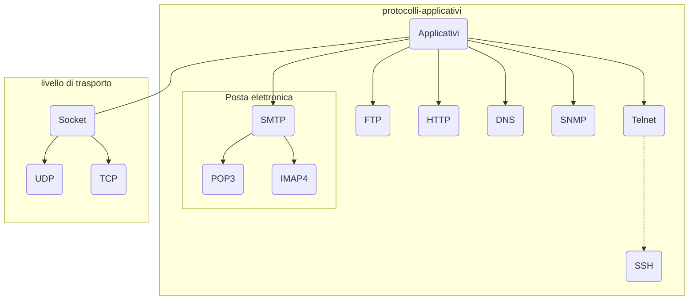

```mermaid
flowchart TB

applicativo(Applicativi)
telnet(Telnet)
ssh(SSH)
ftp(FTP)
http(HTTP)
smtp(SMTP)
pop(POP3)
imap(IMAP4)
dns(DNS)
snmp(SNMP)

socket(Socket)
socket-udp(UDP)
socket-tcp(TCP)

subgraph protocolli-applicativi
applicativo --> telnet
applicativo --> ftp
applicativo --> http
applicativo --> dns
applicativo --> snmp

applicativo --> smtp
subgraph protocolli-posta[Posta elettronica]
smtp --> pop
smtp --> imap
end

telnet -..-> ssh
end

applicativo --- socket
subgraph trasporto[livello di trasporto]
socket --> socket-udp
socket --> socket-tcp
end
```

