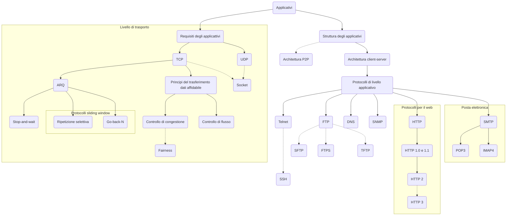

```mermaid
flowchart TB

applicativi(Applicativi)
strutturaapplicativi(Struttura degli applicativi)
requisitiapplicativi(Requisiti degli applicattivi)

tcp(TCP)
udp(UDP)
socket(Socket)
arq(ARQ)
sw(Stop-and-wait)
gbn(Go-back-N)
sr(Ripetizione selettiva)

affidabilita(Principi del trasferimento dati affidabile)
controlloflusso(Controllo di flusso)
controllocongestione(Controllo di congestione)
fairness(Fairness)

architetturaP2P(Architettura P2P)
architetturacs(Architettura client-server)

applicativo(Protocolli di livello applicativo)
telnet(Telnet)
ssh(SSH)
ftp(FTP)
smtp(SMTP)
pop(POP3)
imap(IMAP4)
dns(DNS)
snmp(SNMP)
http(HTTP)

http1(HTTP 1.0 e 1.1)
http2(HTTP 2)
http3(HTTP 3)

sftp(SFTP)
ftps(FTPS)
tftp(TFTP)

applicativi --> requisitiapplicativi
subgraph protocolli-trasporto[Livello di trasporto]
requisitiapplicativi --> tcp
requisitiapplicativi --> udp

tcp --> arq
arq --> sw

arq --> sr
arq --> gbn

tcp --> affidabilita
affidabilita --> controllocongestione
affidabilita --> controlloflusso

controllocongestione -.-> fairness

subgraph sliding-window-protocolo[Protocolli sliding window]
sr
gbn
end
udp -.-> socket
tcp -.-> socket
end

applicativi --> strutturaapplicativi
strutturaapplicativi -.-> architetturaP2P
strutturaapplicativi --> architetturacs
architetturacs --> applicativo
applicativo --> telnet
applicativo --> ftp
applicativo --> dns
applicativo --> snmp
applicativo --> http

subgraph protocolli-web[Protocolli per il web]
http --> http1
http1 --> http2
http2 -.-> http3
end

ftp -.-> sftp
ftp -.-> ftps
ftp -.-> tftp

applicativo --> smtp
subgraph protocolli-posta[Posta elettronica]
smtp --> pop
smtp --> imap
end

telnet -..-> ssh
```

