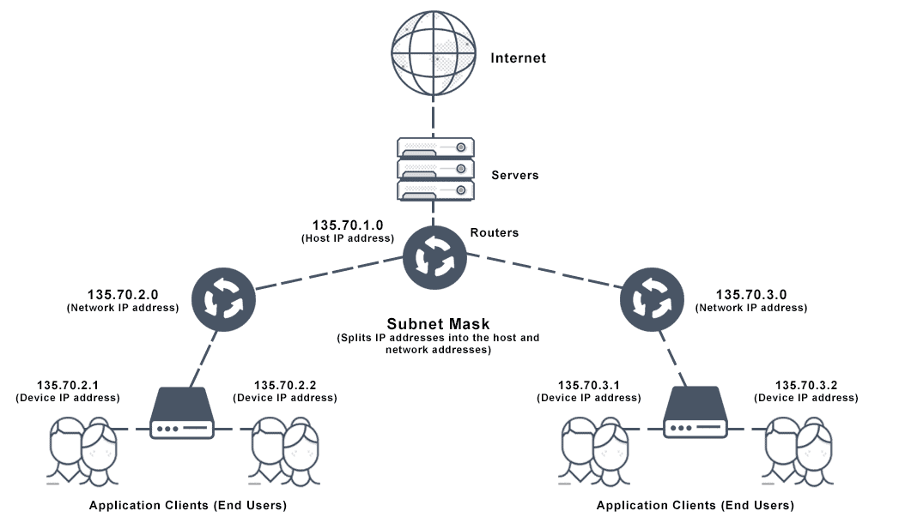
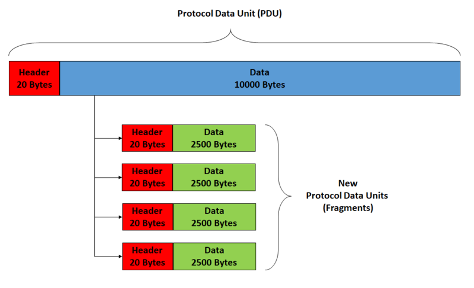
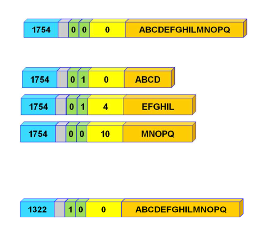
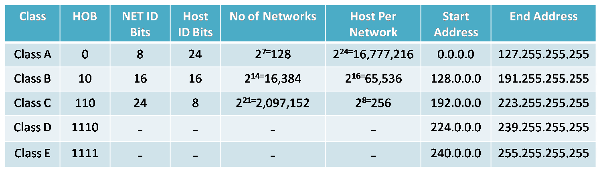
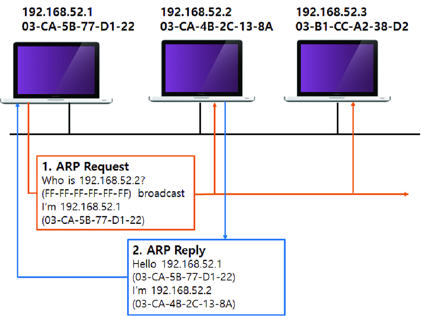
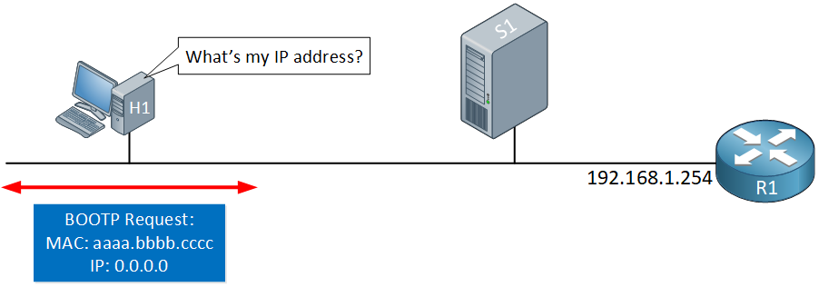
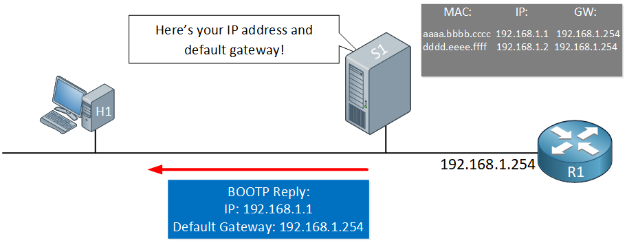
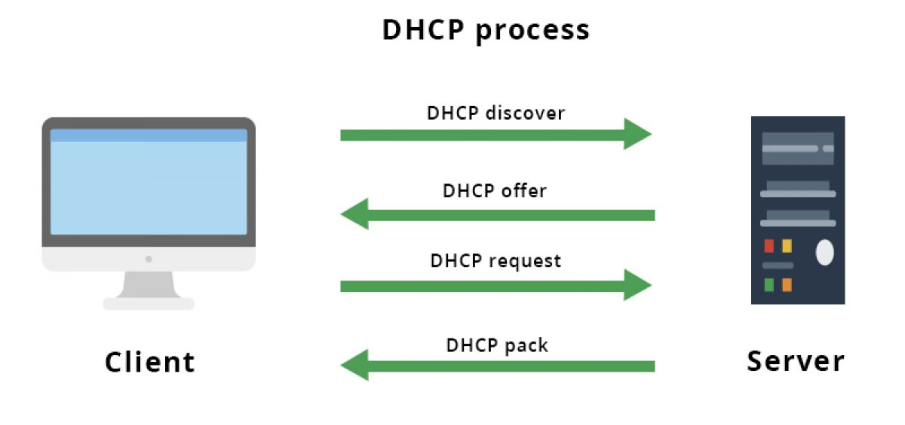
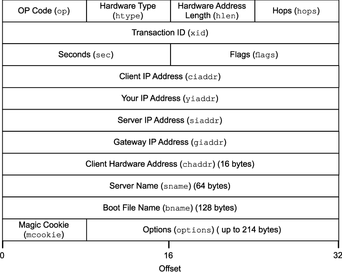

# LIVELLO DI RETE

### Reti a commutazione di pacchetto e reti a circuito virtuale: overview

Nelle telecomunicazioni distinguiamo tra due tipi di rete, quelle a **commutazione di pacchetto** e quelle a **circuito virtuale**, anche dette a commutazione di circuito.

Le reti a commutazione di circuito nascono ben prima di quelle a commutazione di pacchetto, un esempio ne sono le vecchie centraline telefoniche dove il circuito tra i due estremi andava impostato manualmente dalla centralinista. Se un tempo però le comunicazioni di questo tipo occupavano l'intero canale, rendendo impossibile ad altri flussi di dati percorrerlo, ad oggi i canali sono **partizionabili in frequenza, tempo, lunghezza d'onda e codice**.

Uno dei vantaggi della commutazione di pacchetto è che la comunicazione **non è soggetta a ritardi variabili** ma solo a quelli introdotti dallo stabilimento della connessione e dalla trasmissione sul canale e, limitatamente alla frazione che gli è dedicata, ha un **bit rate garantito**. Di contro però **non è un approccio scalabile né economico né tanto meno fault tolerance**, porta inoltre con sé un enorme spreco del canale. Le risorse dedicate alla comunicazione vanno sprecate nel momento in cui gli estremi non hanno nulla da trasmettere. Si può osservare come, in situazioni normali, gli estremi siano attivi solo per una piccola parte del tempo, lasciando in media buona parte del tempo il canale inutilizzato. 

La commutazione di pacchetto al contrario è molto adatta ai casi in cui più nodi siano interessati a trasmettere e molto più resiliente ai guasti, sebbene sia **soggetta a ritardi variabili** e debba prevedere un **complesso controllo di congestione**. Internet è una rete a commutazione di pacchetto.

### Servizi offerti dal livello di rete

Il compito del livello di rete è quello di trasportare i pacchetti ricevuti dal livello di trasporto da un host ad un altro, si occupa quindi di due aspetti fondamentali:

- il **forwarding**: ovvero la logica che determina su quali collegamenti inoltrare i pacchetti affinché possano giungere a destinazione (solitamente implementata via hardware)
- il **routing**: come stabilire il percorso che suddetto pacchetto debba seguire per arrivare alla destinazione (solitamente implementato via software)

Non trattiamo più esclusivamente l'aspetto end-to-end della comunicazione, come facevamo per il livello di trasporto, ma ci ritroviamo a dover lavorare con i nodi intermedi, i router. Troviamo quindi implementazioni delle funzionalità dei protocolli di livello di rete sia sugli host che sui router. I pacchetti a livello di rete vengono generalmente chiamati **datagram**.

Come discusso per il livello di trasporto, anche il livello di rete può offrire o meno una certa quantità di servizi al livello superiore, quali ad esempio:

- consegna garantita
- consegna garantita con ritardo limitato
- consegna ordinata
- banda minima garantita
- sicurezza

Ed altri ancora. Il protocollo IP, adottato da Internet, lavora secondo un modello **best-effort** quindi **non garantisce nessuno di questi servizi**, sebbene "faccia del proprio meglio".

### IPv4

Nato nei primi anni 80, IP versione 4 ad oggi rappresenta ancora lo standard di riferimento di Internet per quanto riguarda il livello di rete, sebbene si stia lentamente migrando alla versione 6 per porre rimedio ad alcune sue criticità descritte in seguito.

Lo schema utilizzato da IPv4 si basa su due concetti principali, utilizzati per identificare gli host:

- **la rete all'interno del quale l'host si trova**
- **il suo indirizzo, relativamente alla rete**

Secondo questa struttura un host afferisce ad una rete e, come vedremo a breve, ciò determina lo *scope di visibilità* e le politiche di istradamento adottate.

#### Struttura dei datagram IPv4

L'intestazione IPv4 consiste di **20 byte**, campi opzionali esclusi, e funge da wrapper alle già descritte intestazioni UDP e TCP del livello di trasporto. Gli header di livello di trasporto vengono quindi trasportati all'interno del datagram come payload. Nel caso di una classica intestazione TCP ad esempio abbiamo un totale di 40 byte, 20 di IP e 20 di TCP, più gli eventuali dati di livello applicativo.

Ritroviamo nell'intestazione di un datagram IPv4 i seguenti campi:

- **versione**: indica la versione del protocollo, in questo caso 4 (4 bit)

- **lunghezza dell'intestazione**: indica la fine del preambolo e l'inizio del payload (4 bit)

- **tipo di servizio (ToS)**: designato per indicare differenti tipi di traffico e conseguente bisogno di servizi differenti (alta affidabilità, basso ritardo etc...). Non utilizzato (8 bit)

- **lunghezza del datagram**: la dimensione, payload incluso (16 bit)

- **ID**: identificativo del datagram e dei suoi eventuali frammenti (16 bit)

- flag inerenti la **frammentazione**:

  - **DF**: divieto esplicito di frammentazione (1 bit)
  - **MF**: indica la presenza di ulteriori frammenti a seguire (1 bit)

  I flag sono preceduti da una porzione inutilizzata.

- **offset di frammentazione**: offset dei frammenti rispetto all'inizio del flusso dati (12 bit)
- **TTL**: time to live. Limite di vita di un datagram all'interno della rete. Generalmente impostato a 255, viene decrementato ad ogni passaggio da un router. Se arriva a 0 il datagram viene scartato (8 bit)
- **protocollo**: indica quale protocollo è utilizzato a livello superiore. 6 per TCP, 17 per UDP (8 bit)

- **header checksum**: calcolato solo sull'intestazione IP (16 bit)
- indirizzo sorgente
- indirizzo di destinazione
- options

Il campo **options**, introdotto per utilizzo sporadico, rappresenta una delle criticità di IPv4. Sebbene non sia spesso utilizzato, la sua presenza impedisce all'intestazione di avere una lunghezza fissa, ciò complica la struttura del protocollo. Il campo può inoltre contenere informazioni che devono essere processate dai router lungo il percorso, complicandone la logica e aggiungendo ulteriori ritardi. Per questo motivo il campo options è stato rimosso da IPV6 e, come vedremo a seguire, la logica per gestire informazioni opzionali spostata all'interno di altri datagram.

##### Frammentazione

Come visto per il livello di trasporto, la dimensione dei segmenti è spesso limitata dalla **MTU**, la quantità massima di dati trasportabili dal livello DLL, nel nostro caso incapsulabili in una frame Ethernet. IP non fa eccezione.

Se il pacchetto, compreso quindi dell'intestazione IP, di quella fornita dal livello di trasporto e dei dati di livello applicativo, risulta troppo grande per venire incapsulato in una singola frame Ethernet viene frammentato. Ricordiamo che Ethernet ammette un payload di al massimo **1500 byte**, quindi ammesso di utilizzare 40 byte complessivi per gli header TCP/IP, abbiamo a disposizione 1460 byte per i dati di livello applicativo (compresi quindi gli header del protocollo applicativo utilizzato). 

Il campo **fragment offset** indica il primo byte di payload contenuto nel successivo datagram. Ogni datagram quindi viene corredato dell'intestazione IP ma trasporta un payload più piccolo.

A questo punto è chiaro che la rete segua pesantemente una **struttura a matrioska** e che il payload di ogni livello comprenda gli header del livello superiore (questo almeno in fase di invio).

Nel caso il bit di divieto di frammentazione **DF** sia impostato ad 1 quanto detto fino ad ora non vale. In questi casi alla richiesta di non frammentare, giunta dal livello superiore, si scarta il paccheto e si risponde con un messaggio di errore **ICMP**, che vedremo più avanti, indicativo del fatto che il messaggio compressivo sia troppo grande. Si delega quindi al livello superiore l'eventuale ridimensionamento.

#### Struttura degli indirizzi

Utilizzando **32 bit** per rappresentare gli host abbiamo a disposizione uno spazio degli indirizzi di $2^{32}$, cioè circa **4 miliardi di indirizzi**. Dovendo però rappresentare **univocamente** ogni host connesso ad Internet nel mondo pure una quantità così ampia di indirizzi si è esaurita da tempo, il che ci porta ad un'altra delle criticità di IPv4. Complici la cattiva gestione e il moltiplicarsi dei dispositivi connessi alla rete, ormai più di una decina di anni fa veniva allocato l'ultimo blocco di indirizzi IPv4. Nonostante ciò, gli indirizzi utilizzati ad oggi ancora in buona parte di tipo IPv4, rappresentati come **4 gruppi di decimali, ognuno con valore da 0 a 255, in notazione puntata (dotted)**.

Le tabelle a seguire mostrano alcuni indirizzi e range di indirizzi con relativi scopi designati. Nello specifico, la seconda tabella presenza i range degli indirizzi definiti come **privati**, ovvero per uso interno alle sotto-reti e non utilizzabili su Internet. Come vedremo subito sotto, questo tipo di indirizzi nasce nel contesto dell'indirizzamento classfull, sebbene sia una convenzione adottata anche nello schema classless.

| Nomenclatura | Indirizzo                   | Note                                                         |
| ------------ | --------------------------- | ------------------------------------------------------------ |
| Broadcast    | 255.255.255.255             | Inoltrare a tutti gli host presenti sulla rete               |
| Gateway      | 255.255.255.254             | Inoltrare al di fuori della rete                             |
| Loopback     | 127.0.0.0 – 127.255.255.255 | Utilizzati dal host stesso                                   |
| Questo host  | 0.0.0.0                     | Utilizzato in fase di ingresso nella rete, prima di ottenere un indirizzo valido |

| Classe di riferimento | Range di indirizzi            |
| --------------------- | ----------------------------- |
| A                     | 10.0.0.0 – 10.255.255.255     |
| B                     | 172.16.0.0 – 172.31.255.255   |
| C                     | 192.168.0.0 – 192.168.255.255 |

Alcune precisazione vanno fatte in merito agli indirizzo mostrati:

- l'indirizzo di broadcast è presentato nel suo formato universale, se si vuole fare riferimento al broadcast specifico della sottorete la notazione da utilizzare prevede l'identificativo della rete e la restante parte, destinata agli host, posta a 255. Ad esempio se la rete è identificata dall'indirizzo $192.168.x.x$ il suo indirizzo di broadcast sarà $192.168.255.255$
- valgono le stesse considerazioni in merito all'indirizzo di gateway, che è generalmente assegnato all'ultimo indirizzo allocabile prima del broadcast, quindi il $x.x.x.254$
- il range degli indirizzi destinati al loopback, anche detti localhost è un'altra prova della cattiva gestione di IPv4. Allocare un tanto ampio blocco per l'utilizzo interno da parte dell'host è l'ennesima forma di spreco. Gli indirizzi di tipo $127.x.x.x$, come quelli privati, non possono essere utilizzati su Internet.

#### Schemi di indirizzamento: classfull e classless

Il tradizionale schema di indirizzamento **classfull**, maggiore causa dell'enorme spreco di indirizzi IPv4, prevedeva la suddivisione in classi e l'attribuzione di **netmask esclusivamente a 8, 16, e 24 bit**. Come descriveremo più avanti, la netmask è il modo attraverso cui l'indirizzo viene suddiviso e una quantità variabili dei suoi bit più significati e meno significativi vengono rispettivamente utilizzati per indicare la rete e l'host all'interno di essa.

Utilizzando questo schema otteniamo indirizzi di classe A, B e C, che si differenziano per il numero di host che possono identificare al proprio interno. In indirizzi di classe A il primo byte veniva utilizzato per rappresentare la rete e i restanti per gli host. Gli indirizzi di classe B utilizzavano invece i primi due byte e quelli di classe C i primi 3. Abbiamo quindi rispettivamente $2^{24}$ indirizzi disponibili per la classe A, $2^{16}$ per la B e $2^8$ per la C.

Supponendo di aver bisogni di 40.000 indirizzi, un numero ragionevole se si pensa ad un'università ad esempio, la scelta più opportuna sarebbe un indirizzo di classe B, con un inevitabile spreco di circa 15 mila indirizzi. Ancora peggiore può essere il caso in cui magari si abbia bisogno di 2000 indirizzi, troppi per la C ma decisamente pochi rispetto a quelli che può ricoprire la classe B.

Gli indirizzi di classe D ed E furono pensati per il multicast e evenutali gestione future ma ad oggi non sono utilizzati.

Lo schema **classless** risulta invece **più flessibile**, adatto a definire reti con il range di indirizzi disponibili quanto più vicino a quello di interesse. Utilizzando uno schema classless è infatti possibile applicare qualunque netmask e ripartire gli indirizzi secondo le proprie esigenze. Questo tipo di indirizzamento è anche noto come **CIDR (Classless Inter-Domain Routing)**

#### Indirizzamento locale e sulla rete

Gestire il modo in cui un dato pacchetto, partito da una sorgente, arrivi alla destinazione indicata è uno dei principali compiti del livello di rete. Qui ritroviamo entrambi i concetti di routing e forwarding. Distinguiamo i casi in cui l'indirizzamento avviene limitatamente alla stesse rete e quello in cui invece il destinatario si trova all'esterno.

##### Indirizzamente intraLAN

###### Address Resolution Protocol (ARP)

Il protocollo **ARP (Address Resolution Protocol)** appartiene alla suite dei **protocolli di utility** di IPv4 e viene utilizzato per *mappare* gli indirizzi IP agli indirizzi MAC. L'esigenza di mettere in relazione i due si presenta perché la vera e propria comunicazione avviene a livello di **datalink**, che opera con i **MAC address**, e quindi si ha la necessità di conoscere il MAC address del destinatario in maniera tale da inserirlo opportunamente all'interno della frame Ethernet. Abbiamo quindi un altro esempio di violazione della struttura a livelli.

Per scoprire il corrispondente indirizzo MAC l'host mittente inoltra in broadcast un pacchetto, detto **ARP Request**, indicando il proprio indirizzo IP e MAC e l'indirizzo IP del destinatario. Tutti gli altri host sono in ascolto del canale. L'host interessato risponde con una **ARP Reply**, riportando l'indirizzo IP e MAC del mittente originale come destinazione e impostando il proprio IP e MAC come sorgente. Durante questo scambio di messaggi sia i diretti interessati che gli altri host in ascolto sul canale inseriscono gli indirizzi nella così detta **ARP cache** (o ARP table), impostando per ogni coppia di indirizzi un TTL.

Effettuata con successo la mappatura è possibile inoltrare il pacchetto al destinatario

Come per tutti gli altri host, anche le interfacce del router connesse alla LAN vengono mappate dal protocollo. Se l'indirizzo di destinazione si trova al di fuori della rete infatti i pacchetti vengono semplicemente inoltrati al router come se fosse un host ordinario.

Alcune delle criticità più evidenti di ARP sono l'**assenza di meccanismi di autenticazione e di stato** (non ci sono identificativi di transazione). È possibile quindi dirottare il traffico IP semplicemente inoltrando un pacchetto ARP Reply contraffatto, indicando il proprio indirizzo MAC come destinazione e l'indirizzo IP di interesse. Indichiamo questo tipo di attacchi come **IP spoofing** e **ARP spoofing** (o **ARP cache poisoning**)

###### Reverse Address Resolution Protocol (RARP)

In maniera abbastanza speculare al protocollo ARP, il protocollo **RARP** veniva utilizzato per **risalire all'indirizzo IP utilizzando il MAC address**. Il caso d'uso più frequente era uno scenario molto simile ai più moderni protocolli BOOTP e DHCP, dove un host al proprio ingresso nella rete richiede un indirizzo IP. Il **server RARP** di solito fornisce all'host che ne fa richiesta un nuovo indirizzo oppure uno precedentemente utilizzato da questo, non ancora scaduto.

In merito alla sicurezza valgono considerazioni analoghe a quelle fatte per il protocollo ARP.

###### BOOTP

BOOTP è stato un protocollo di tipo **client-server**, precursore del più moderno e attuale DHCP. Analogamente a RARP, veniva utilizzato dall'host per richiedere un indirizzo IP, pescato da un **pool di indirizzi statici**, lo contraddistingueva però la particolarità di venire utilizzato per caricare la **boot-image remota**, quindi a seguire di una richiesta BOOTP veniva aperta una connessione di tipo FTP per il trasferimento dell'immagine. BOOTP è utilizzabile sia all'interno della stessa LAN che da host esterni.

###### DHCPv4

DHCP è un protocollo applicativo di tipo **client-server** **basato su UDP** utilizzato per l'attribuzione degli indirizzi IP all'interno delle reti LAN. Ne esistono due versioni, una per compatibile con il formato IPv4 e una per il formato IPv6. Descriviamo la versione utilizzata per IPv4 come segue:

- un client che desidera entrare nella LAN necessita di un indirizzo IP, per ottenerlo inoltra un messaggio, detto **DHCP DISCOVER,** in broadcast impostando il proprio indirizzo mittente a $0.0.0.0$ (come avviene per BOOTP) e riportando il proprio indirizzo MAC.
- uno o più server DHCP (se presenti) rispondono, offrendo un indirizzo IP, posto nel campo ``yiaddr`` nel range degli indirizzi disponibili della rete e specificando eventuali altri parametri di configurazione. Questo messaggio, detto **DHCP OFFER** ha come indirizzo MAC di destinazione quello dell'host interessato e come indirizzo IP quello di broadcast, per gli stessi motivi osservati per il protocollo ARP.
- il client seleziona una tra le offerte ricevute e manda un messaggio **DHCP ACCEPT** (o **DHCP REQUEST**) **in broadcast**, specificando l'identificativo del server di cui ha accettato la richiesta. Così facendo gli altri server DHCP sono informati che la richiesta non è più pending ed è stata soddisfatta da qualcun altro.
- infine il server DHCP risponde con un ACK

I quattro messaggi illustrati sono corredati di un **ID di transazione**. Ciò permette di discriminare tra i vari client che entrano nella rete nello stesso istante ed evitare i conflitti.

Come molti altri servizi presenti nella rete, anche DHCP è soggetto ad attacchi di tipo spoofing e man-in-the-middle.

##### Algoritmi di routing

### Assegnamento dei blocchi di indirizzi

Come accennato su, blocchi di indirizzi visibili su Internet vengono assegnati su richiesta. L'autorità che attualmente fornisce e gestisce gli indirizzi IP e i domini a livello mondiale è l'**ICANN (Internet Corporation for Assigned Network and Numbers)**, supportata dai **RIR (Regional Internet Registry)**, organizzazioni che operano a livello continentale. Ad oggi sono presenti nel mondo 5 RIR:

- APNIC (Asia Pacific Network Information Center)
- ARIN (American Registry for Internet Numbers)
- LACNIC (Latin American and Caribbean Internet Addresses Registry)
- RIPE NCC (Réseaux IP Européens Network Coordination Centre)
- AFRINIC (African Regional Internet Registry)

Seguono poi nella gerarchi i **LIR (Local Internet Registries)**, che si occupano della gestione locale. L'ente di riferimento per l'Italia è il [GARR](https://www.servizi.garr.it/lir).
