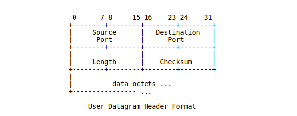
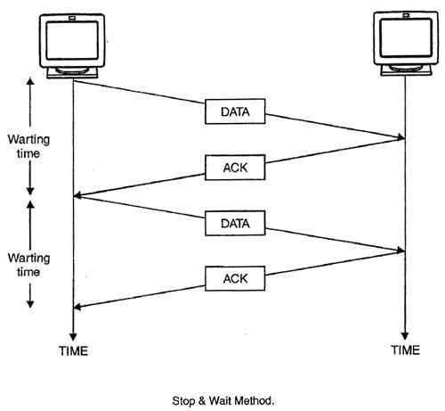
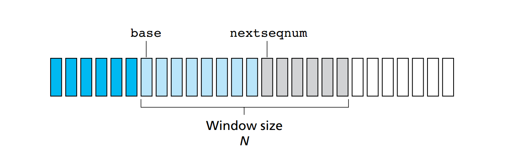

# LIVELLO DI TRASPORTO

Il quarto livello dello stack TCP/IP, collocato tra il livello applicativo e quello di rete, si occupa di fornire ai processi che lavorano a livello applicativo un'astrazione di comunicazione diretta, generalmente detta anche **comunicazione logica**.

Processi in comunicazione logica possono quindi risiedere su host distanti ma dialogare come se fossero vicini, senza doversi preoccupare della strada percorsa dalle informazioni inviate o del traffico sulla rete. Il livello di trasporto riceve quindi messaggi di tipo applicativo da processi differenti e li inoltra su un unico canale di comunicazione (azione di **multiplexing**). Specularmente, in fase di ricezione estrae dal canale e smista verso i rispettivi processi destinatari (azione di **demultiplexing**). Le socket hanno un ruolo centrale in queste due fasi visto che permettono di identificare univocamente i processi e fanno da ponte tra gli host e la rete.

Fatta questa premessa, possiamo facilmente capire perché i protocolli di livello di trasporto sono implementati esclusivamente sui sistemi periferici, quindi secondo una struttura **end-to-end**.

Ci riferiamo ai messaggi che circolano a livello di trasporto come **segmenti**. In alcune descrizioni del protocollo UDP i segmenti vengono anche chiamati **datagram** (la costante `SOCK_DGRAM` è utilizzata in fase di creazione delle socket per specificare che la socket dovrà essere di tipo UDP). Il termine può inizialmente risultare un po' fuorviante visto che datagram è anche il nome con cui si indicano i messaggi a livello di rete.

### Scelta del protocollo a livello di trasporto: overview

Come accennato nella sezione sul livello applicativo, la scelta di un protocollo a livello di trasporto è fortemente basata sulle esigenze dell'applicativo. Vediamo di seguito i due principali protocolli, che ritroviamo abitualmente nei sistemi moderni, nella loro forma pura o con piccole variazioni. 

## Protocollo UDP

Definito nell' [RFC 768](https://datatracker.ietf.org/doc/html/rfc768), UDP è un protocollo minimale che non offre alcun tipo di garanzia in termini di affidabilità, timing, sicurezza, ordine nella ricezione o di qualsiasi altro requisito e, contrariamente a TCP, non mette a disposizione alcuni tipo di servizio per il controllo di flusso o di congestione. Ogni qual volta il livello applicativo richiama UDP questo non fa altro che prendere il datagram e inoltrarlo sulla rete e, in fase di ricezione, effettuare il demultiplexing verso il livello superiore. Non essendoci una fase preliminare per determinare lo stabilimento della connessione tra gli host UDP rientra nella categoria dei protocolli **connection-less**. Nella rappresentazione dei datagram UDP è presente anche un header di checksum. Il checksum è tipicamente una somma in complemento ad uno calcolata sull'intero datagram, a gruppi di 16 bit.

Nel caso in cui si stia utilizzando il protocollo IPv4 a livello di rete, il calcolo del checksum **non è mandatory** (obbligatorio), lo è invece nel caso di IPv6 visto che quest'ultimo non lo prevede al fine di mitigare la ridondanza dei dati. Che il checksum venga o meno calcolato l'header è comunque presente. Se si sceglie di non implementare il checksum il campo viene posto a zero, altrimenti UDP ricostruisce il cosiddetto ***pseudo-header*** basandosi sui dati forniti dal livello IP. Questo viola la struttura a livelli indicata nello stack ISO/OSI che, come preannunciato, TCP/IP non segue rigidamente.

L'RFC non specifica il da farsi in caso di ricezione di un segmento errato, generalmente viene scartato senza ulteriori segnalazioni al mittente. In *Computer Networking: A Top-down Approach di James F. Kurose*, cap. 3 è comunque possibile ritrovare la costruzione step-by-step di un ipotetico protocollo per il trasferimento dati affidabile, partendo da uno scenario simil-UDP.

Viste le premesse UDP potrebbe sembrare un protocollo da evitare il più possibile, il che non è completamente vero.
Venendo a mancare le garanzie sopra citate si elimina una fetta enorme di complessità dal protocollo, ciò si traduce in **overhead minore**, **dimensione dei pacchetti ridotta** e in una certa **velocità nell'inoltro** sul canale. La struttura minimale di UDP fornisce inoltre agli applicativi un maggiore controllo della comunicazione, che passando i propri messaggi a livello di trasporto possono già darli per inviati, senza preoccuparsi di eventuali modifiche e bufferizzazioni. 

Alcuni protocolli applicativi che si appoggiano ad UDP:

| Procotollo applicativo                     | Ambito di utilizzo                  |
| ------------------------------------------ | ----------------------------------- |
| Domain Name System (DNS)                   | Associazione dominio - IP           |
| Simple Network Management Protocol (SNMP)  | Informazioni sullo stato della rete |
| Routing Information Protocol (RIP)         | Informazioni sullo stato della rete |
| Dynamic Host Configuration Protocol (DHCP) | Assegnazione indirizzi IP           |

## Protocollo TCP: premesse

### Costruzione di un protocollo di trasporto affidabile

Rimandando alla trattazione abbastanza discorsiva del Kurose (cap.3 par. 4.1), si elencano a seguire i principali punti per la costruzione di un protocollo che implementi il trasferimento dati affidabile, comuni anche al protocollo TCP.

Partendo da uno scenario reale, ovvero avendo un servizio a livello di rete di tipo ***best-effort*** come IP, quindi privo di garanzie, ed un mezzo fisico capace di alterare o addirittura perdere i pacchetti, per garantire il trasferimento dati affidabile abbiamo bisogno di:

- un feedback del destinatario sull'avvenuta ricezione
- un meccanismo di ritrasmissione
- un modo per distinguere pacchetti ritrasmessi da quelli originali
- un meccanismo di error detection
- un policy sul tempo di attesa e di ritrasmissione per i pacchetti

#### Acknowledgement

All'avvenuta ricezione di un pacchetto viene mandato al mittente un messaggio di conferma, detto **ACK**. Di fatto, l'ACK non gode di particolari privilegi e come tutti gli altri pacchetti può perdersi ed essere soggetto ad errori.

#### Controllo degli errori

Dovendo discriminare tra pacchetti ricevuti correttamente e pacchetti errati, il calcolo del checksum risulta obbligatorio. Alcuni protocolli potrebbero prevedere la notifica esplicita della ricezione di un pacchetto errato attraverso un NAK, utilizzando eventualmente più bit per rappresentare l'ACK e il NAK. TCP non offre né ACK negativi né un servizio di correzione degli errori, si limita quindi a scartare i pacchetti errati.

#### Ritrasmissione

In assenza di ACK e allo scadere di un tempo di attesa stabilito risulta abbastanza evidente che il pacchetto è andato perso o che è stato corrotto. Il mittente deve reinoltrare il pacchetto sul canale.

#### Distinguere tra pacchetti (e ACK) duplicati

Essendo la comunicazione asincrona bisogna tenere dei riferimenti ai pacchetti di cui si attende risposta e a cui si da conferma. TCP utilizza un meccanismo basato su **numeri di sequenza** per indicare a quali si sta facendo riferimento. In presenza di più pacchetti con lo stesso numero di sequenza abbiamo quindi delle duplicazioni, segno che c'è stata una ritrasmissione. Anche gli ACK indicano il numero del pacchetto a cui stanno dando conferma, di conseguenza più ACK in riferimento allo stesso pacchetto solo duplicati.

#### Policy di attesa e reinoltro

Come vedremo in seguito, la scelta del tempo di attesa influenza molto le prestazioni e il benessere della rete. Va in oltre definito se il timer di attesa debba essere riferito al singolo pacchetto o ad un'insieme di pacchetti e quanto questo debba essere grande. TCP adotta un approccio con **finestra di ricezione a dimensione variabile** nel tempo dove il timer viene avviato a partire dal pacchetto più vecchio che non ha ancora ricevuto ancora riscontro e la stima viene aggiornata periodicamente tenendo conto dello stato della rete.

### Strategie di controllo degli errori e ritrasmissione

Come visto, TCP si limita a scartare i pacchetti errati e l'assenza di ACK viene interpretata dal mittente come una perdita, a cui quest'ultimo risponde con la ritrasmissione del pacchetto in questione. Questa strategia è detta **Automatic Repeat-reQuest (ARQ)**. Un protocollo che segua una strategia ARQ può gestire la ritrasmissione principalmente in tre modi:

- Stop-and-wait
- Go-back-N
- Ripetizione selettiva

### Protocollo Stop-and-wait

Stop-and-wait è un protocollo semplice quanto inefficiente nel quale i pacchetti vengono inviati uno per volta e prima di procedere al successivo invio viene attesa la conferma del precedente. Allo scattare del timer un pacchetto che non ha ancora ricevuto risposta viene ritrasmesso e la comunicazione rimarrà bloccata fino a che questo non riceverà conferma. Una simile gestione porta quindi ad uno spreco enorme del canale, che rimane inattivo la maggior parte del tempo.

Organizzare le richieste in pipeline risulta invece molto più efficiente. Go-back-N e Ripetizione selettiva adottano questa strategia.

### Go-back-N

Il protocollo Go-back-N prevede di inoltrare sulla rete i pacchetti in pipelining, limitando il numero di pacchetti in attesa di ACK. Gli $N$ slot costituiscono la cosiddetta *finestra di ricezione*, che si sposta man mano che i pacchetti vengono confermati. All'interno di una finestra di ricezione abbiamo quindi le variabili:

- $base$ che indica l'inizio della finestra corrente
- $base + N - 1$ che indica l'ultimo slot della finestra corrente
- $nextseqnum$, ovvero il primo slot libero nella finestra corrente

Gli slot corrispondono ai numeri di sequenza con cui è possibile etichettare i nuovi messaggi da spedire.

Il protocollo utilizza **ACK cumulativi**, di conseguenza alla ricezione di un ACK correlato ad un pacchetto con un numero di sequenza $i$, dove  $base < i < base + N - 1$ tutti gli altri pacchetti compresi nell'intervallo $[base, i]$ vengono a loro volta confermati. Specularmente, al verificarsi di un evento di perdita per il pacchetto con numero di sequenza $i$, tutti i pacchetti nell'intervallo $[base,i]$ verranno ritrasmessi. Vista la struttura del protocollo per il ricevente GBN ha più senso scartare eventuali pacchetti fuori sequenza che conservarli in un buffer. Non potendo confermare in maniera esclusiva il pacchetto $j$ , $i<j$, allo sliding della finestra il pacchetto $j$ verrebbe comunque ritrasmesso.

Limitare la dimensione della finestra, come si vedrà poi anche in TCP, è uno strumento utile per il **controllo di flusso** e di **congestione**. Purtroppo però la gestione offerta da questo protocollo non risulta ottimale visto che le ritrasmissioni possono avvenire in blocco e per pacchetti che non ne necessiterebbero.

Go-back-N, come Ripetizione selettiva, fa parte dei protocolli di tipo **sliding window**.

### Ripetizione selettiva

Volendo evitare ritrasmissioni superflue, il protocollo Ripetizione selettiva risulta più adatto. SR infatti utilizza **ACK selettivi** per confermare i pacchetti all'interno della finestra di ricezione, si può quindi configurare la situazione in cui un alcuni pacchetti risultano confermati e altri no. Il destinatario SR si occupa quindi di bufferizzare i pacchetti e una volta ricevuta l'intera sequenza in finestra la trasmette a livello superiore.
Un problema non trascurabile di questo approccio è che **non sempre le finestre del mittente e del destinatario coincidono**. Se il destinatario inoltra un ACK e questo va perso la finestra del mittente non potrà andare avanti. Essendo la finestra organizzata secondo un indice in modulo può accadere che la finestra del destinatario slitti alla sequenza successiva mentre quella del mittente rimanga bloccata sulla precedente. Ciò per essere risolto limitando la dimensione della finestra in modo che sia **minore o uguale alla metà dello spazio dei numeri di sequenza**.

## Protocollo TCP

### Stima del round trip time (RTT) e calcolo del timer

Quanto tempo attendere una volta che il segmento è stato immesso nella rete prima di darlo per perso e ritrasmetterlo è un punto di fondamentale importanza per una buona gestione della comunicazione. Di fatto, la congestione non è causata dal forte traffico ma dalla **presenza eccessiva di traffico non utile**, quali appunto i pacchetti duplicati.
Più le stime e la conseguente scelta del timer risultano accurate minore sarà la probabilità di congestionare la rete.

TCP si appoggia ad un sistema di **media mobile esponenziale ponderata (EWMA)** e tiene conto della deviazione tra il tempo stimato per il singolo pacchetto e quello complessivo per definire in maniera efficiente i tempi di reinoltro.

$EstimatedRTT_n = (1-{\alpha})EstimatedRTT_{n-1} + {\alpha}SampleRTT_n$

tipicamente con ${\alpha} = \frac{1}{8}$

$DevRTT = (1 - \beta)DevRTT + \beta|SampleRTT_n - EstimatedRTT_{n-1}|$

tipicamente con $\beta = \frac{1}{4}$

**Il valore della deviazione risulta essere più grande in caso di grosse fluttuazioni e più piccolo in caso di tempi uniformi.**

Calcoliamo infine il timeout utilizzando i due valori precedenti come segue:

$TimeoutInterval = EstimatedRTT + 4DevRTT$

In assenza di valori, ovvero **all'inizio della connessione, $TimeoutInverval$ è generalmente impostato a 1**.
**Ogni qual volta si verifica un timeout il valore viene raddoppiato**, per poi venire ricalcolato alla corretta ricezione di un segmento atteso e conseguente aggiornamento dell' $EstimatedRTT$