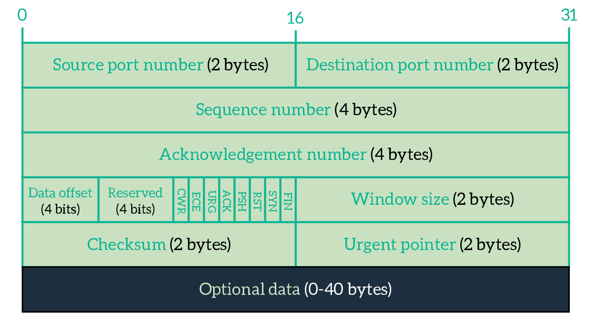

# LIVELLO DI TRASPORTO

Il quarto livello dello stack TCP/IP, collocato tra il livello applicativo e quello di rete, si occupa di fornire ai processi che lavorano a livello applicativo un'astrazione di comunicazione diretta, generalmente detta anche **comunicazione logica**.

Processi in comunicazione logica possono quindi risiedere su host distanti ma dialogare come se fossero vicini, senza doversi preoccupare della strada percorsa dalle informazioni inviate o del traffico sulla rete. Il livello di trasporto riceve quindi messaggi di tipo applicativo da processi differenti e li inoltra su un unico canale di comunicazione (azione di **multiplexing**). Specularmente, in fase di ricezione estrae dal canale e smista verso i rispettivi processi destinatari (azione di **demultiplexing**). Le socket hanno un ruolo centrale in queste due fasi visto che permettono di identificare univocamente i processi e fanno da ponte tra gli host e la rete.

Fatta questa premessa, possiamo facilmente capire perché i protocolli di livello di trasporto sono implementati esclusivamente sui sistemi periferici, quindi secondo una struttura **end-to-end**.

Ci riferiamo ai messaggi che circolano a livello di trasporto come **segmenti**. In alcune descrizioni del protocollo UDP i segmenti vengono anche chiamati **datagram** (la costante `SOCK_DGRAM` è utilizzata in fase di creazione delle socket per specificare che la socket dovrà essere di tipo UDP). Il termine può inizialmente risultare un po' fuorviante visto che datagram è anche il nome con cui si indicano i messaggi a livello di rete.

### Scelta del protocollo a livello di trasporto: overview

Come accennato nella sezione sul livello applicativo, la scelta di un protocollo a livello di trasporto è fortemente basata sulle esigenze dell'applicativo. Vediamo di seguito i due principali protocolli, che ritroviamo abitualmente nei sistemi moderni, nella loro forma pura o con piccole variazioni. 

## Protocollo UDP

Definito nell' [RFC 768](https://datatracker.ietf.org/doc/html/rfc768), UDP è un protocollo minimale che non offre alcun tipo di garanzia in termini di affidabilità, timing, sicurezza, ordine nella ricezione o di qualsiasi altro requisito e, contrariamente a TCP, non mette a disposizione alcuni tipo di servizio per il controllo di flusso o di congestione. Ogni qual volta il livello applicativo richiama UDP questo non fa altro che prendere il datagram e inoltrarlo sulla rete e, in fase di ricezione, effettuare il demultiplexing verso il livello superiore. Non essendoci una fase preliminare per determinare lo stabilimento della connessione tra gli host UDP rientra nella categoria dei protocolli **connection-less**. Nella rappresentazione dei datagram UDP è presente anche un header di checksum. Il checksum è tipicamente una somma in complemento ad uno calcolata sull'intero datagram, a gruppi di 16 bit.


Nel caso in cui si stia utilizzando il protocollo IPv4 a livello di rete, il calcolo del checksum **non è mandatory** (obbligatorio), lo è invece nel caso di IPv6 visto che quest'ultimo non lo prevede al fine di mitigare la ridondanza dei dati. Che il checksum venga o meno calcolato l'header è comunque presente. Se si sceglie di non implementare il checksum il campo viene posto a zero, altrimenti UDP ricostruisce il cosiddetto ***pseudo-header*** basandosi sui dati forniti dal livello IP. Questo viola la struttura a livelli indicata nello stack ISO/OSI che, come preannunciato, TCP/IP non segue rigidamente.

L'RFC non specifica il da farsi in caso di ricezione di un segmento errato, generalmente viene scartato senza ulteriori segnalazioni al mittente. In *Computer Networking: A Top-down Approach di James F. Kurose*, cap. 3 è comunque possibile ritrovare la costruzione step-by-step di un ipotetico protocollo per il trasferimento dati affidabile, partendo da uno scenario simil-UDP.

Viste le premesse UDP potrebbe sembrare un protocollo da evitare il più possibile, il che non è completamente vero.
Venendo a mancare le garanzie sopra citate si elimina una fetta enorme di complessità dal protocollo, ciò si traduce in **overhead minore**, **dimensione dei pacchetti ridotta** e in una certa **velocità nell'inoltro** sul canale. La struttura minimale di UDP fornisce inoltre agli applicativi un maggiore controllo della comunicazione, che passando i propri messaggi a livello di trasporto possono già darli per inviati, senza preoccuparsi di eventuali modifiche e bufferizzazioni. 

Alcuni protocolli applicativi che si appoggiano ad UDP:

| Procotollo applicativo                     | Ambito di utilizzo                  |
| ------------------------------------------ | ----------------------------------- |
| Domain Name System (DNS)                   | Associazione dominio - IP           |
| Simple Network Management Protocol (SNMP)  | Informazioni sullo stato della rete |
| Routing Information Protocol (RIP)         | Informazioni sullo stato della rete |
| Dynamic Host Configuration Protocol (DHCP) | Assegnazione indirizzi IP           |

## Protocollo TCP

### Costruzione di un protocollo di trasporto affidabile

Rimandando alla trattazione abbastanza discorsiva del Kurose (cap.3 par. 4.1), si elencano a seguire i principali punti per la costruzione di un protocollo che implementi il trasferimento dati affidabile, comuni anche al protocollo TCP.

Partendo da uno scenario reale, ovvero avendo un servizio a livello di rete di tipo ***best-effort*** come IP, quindi privo di garanzie, ed un mezzo fisico capace di alterare o addirittura perdere i pacchetti, per garantire il trasferimento dati affidabile abbiamo bisogno di:

- un feedback del destinatario sull'avvenuta ricezione
- un meccanismo di ritrasmissione
- un modo per distinguere pacchetti ritrasmessi da quelli originali
- un meccanismo di error detection
- un policy sul tempo di attesa e di ritrasmissione per i pacchetti

#### Acknowledgement

All'avvenuta ricezione di un pacchetto viene mandato al mittente un messaggio di conferma, detto **ACK**. Di fatto, l'ACK non gode di particolari privilegi e come tutti gli altri pacchetti può perdersi ed essere soggetto ad errori.

#### Controllo degli errori

Dovendo discriminare tra pacchetti ricevuti correttamente e pacchetti errati, il calcolo del checksum risulta obbligatorio. Alcuni protocolli potrebbero prevedere la notifica esplicita della ricezione di un pacchetto errato attraverso un NAK, utilizzando eventualmente più bit per rappresentare l'ACK e il NAK. TCP non offre né ACK negativi né un servizio di correzione degli errori, si limita quindi a scartare i pacchetti errati.

#### Ritrasmissione

In assenza di ACK e allo scadere di un tempo di attesa stabilito risulta abbastanza evidente che il pacchetto è andato perso o che è stato corrotto. Il mittente deve reinoltrare il pacchetto sul canale.

#### Distinguere tra pacchetti (e ACK) duplicati

Essendo la comunicazione asincrona bisogna tenere dei riferimenti ai pacchetti di cui si attende risposta e a cui si da conferma. TCP utilizza un meccanismo basato su **numeri di sequenza** per indicare a quali si sta facendo riferimento. In presenza di più pacchetti con lo stesso numero di sequenza abbiamo quindi delle duplicazioni, segno che c'è stata una ritrasmissione. Anche gli ACK indicano il numero del pacchetto a cui stanno dando conferma, di conseguenza più ACK in riferimento allo stesso pacchetto solo duplicati.

#### Policy di attesa e reinoltro

Come vedremo in seguito, la scelta del tempo di attesa influenza molto le prestazioni e il benessere della rete. Va in oltre definito se il timer di attesa debba essere riferito al singolo pacchetto o ad un'insieme di pacchetti e quanto questo debba essere grande. TCP adotta un approccio con **finestra di ricezione a dimensione variabile** nel tempo dove il timer viene avviato a partire dal pacchetto più vecchio che non ha ancora ricevuto ancora riscontro e la stima viene aggiornata periodicamente tenendo conto dello stato della rete.

### Strategie di controllo degli errori e ritrasmissione

Come visto, TCP si limita a scartare i pacchetti errati e l'assenza di ACK viene interpretata dal mittente come una perdita, a cui quest'ultimo risponde con la ritrasmissione del pacchetto in questione. Questa strategia è detta **Automatic Repeat-reQuest (ARQ)**. Un protocollo che segua una strategia ARQ può gestire la ritrasmissione principalmente in tre modi:

- Stop-and-wait
- Go-back-N
- Ripetizione selettiva

#### Protocollo Stop-and-wait

Stop-and-wait è un protocollo semplice quanto inefficiente nel quale i pacchetti vengono inviati uno per volta e prima di procedere al successivo invio viene attesa la conferma del precedente. Allo scattare del timer un pacchetto che non ha ancora ricevuto risposta viene ritrasmesso e la comunicazione rimarrà bloccata fino a che questo non riceverà conferma. Una simile gestione porta quindi ad uno spreco enorme del canale, che rimane inattivo la maggior parte del tempo.


Organizzare le richieste in pipeline risulta invece molto più efficiente. Go-back-N e Ripetizione selettiva adottano questa strategia.

#### Protocollo Go-back-N

Il protocollo Go-back-N prevede di inoltrare sulla rete i pacchetti in pipelining, limitando il numero di pacchetti in attesa di ACK. Gli $N$ slot costituiscono la cosiddetta *finestra di ricezione*, che si sposta man mano che i pacchetti vengono confermati. All'interno di una finestra di ricezione abbiamo quindi le variabili:

- $base$ che indica l'inizio della finestra corrente
- $base + N - 1$ che indica l'ultimo slot della finestra corrente
- $nextseqnum$, ovvero il primo slot libero nella finestra corrente

Gli slot corrispondono ai numeri di sequenza con cui è possibile etichettare i nuovi messaggi da spedire.


Il protocollo utilizza **ACK cumulativi**, di conseguenza alla ricezione di un ACK correlato ad un pacchetto con un numero di sequenza $i$, dove  $base < i < base + N - 1$ tutti gli altri pacchetti compresi nell'intervallo $[base, i]$ vengono a loro volta confermati. Specularmente, al verificarsi di un evento di perdita per il pacchetto con numero di sequenza $i$, tutti i pacchetti nell'intervallo $[base,i]$ verranno ritrasmessi. Vista la struttura del protocollo per il ricevente GBN ha più senso scartare eventuali pacchetti fuori sequenza che conservarli in un buffer. Non potendo confermare in maniera esclusiva il pacchetto $j$ , $i\lt j$, allo sliding della finestra il pacchetto $j$ verrebbe comunque ritrasmesso.

Limitare la dimensione della finestra, come si vedrà poi anche in TCP, è uno strumento utile per il **controllo di flusso** e di **congestione**. Purtroppo però la gestione offerta da questo protocollo non risulta ottimale visto che le ritrasmissioni possono avvenire in blocco e per pacchetti che non ne necessiterebbero.

Go-back-N, come Ripetizione selettiva, fa parte dei protocolli di tipo **sliding window**.

#### Protocollo Ripetizione selettiva

Volendo evitare ritrasmissioni superflue, il protocollo Ripetizione selettiva risulta più adatto. SR infatti utilizza **ACK selettivi** per confermare i pacchetti all'interno della finestra di ricezione, si può quindi configurare la situazione in cui un alcuni pacchetti risultano confermati e altri no. Il destinatario SR si occupa quindi di bufferizzare i pacchetti e una volta ricevuta l'intera sequenza in finestra la trasmette a livello superiore.
Un problema non trascurabile di questo approccio è che **non sempre le finestre del mittente e del destinatario coincidono**. Se il destinatario inoltra un ACK e questo va perso la finestra del mittente non potrà andare avanti. Essendo la finestra organizzata secondo un indice in modulo può accadere che la finestra del destinatario slitti alla sequenza successiva mentre quella del mittente rimanga bloccata sulla precedente. Ciò per essere risolto limitando la dimensione della finestra in modo che sia **minore o uguale alla metà dello spazio dei numeri di sequenza**.

### Throughput

La misura delle prestazioni di una connessione (ma non solo) è indicata con il termine throughput. Di fatto si dice che per ottenere una buona connessione bisogna "massimizzare il throughput".

In uno scenario reale generale e trasmettere bit di informazione ha un costo sia in termini di tempo che di risorse allocate, a questi vanno aggiunti i ritardi di propagazione e di accodamento nei buffer.

Supponiamo di aver bisogno di un certo tempo $t$ per generare un 1 bit e un canale a 10Mbps, ovvero in grado di trasmettere 10.000.000 bit in un secondo. Per generare un bit sul canale occorrono quindi

$\frac{1}{10.000.000} = 0.1\ \mu s$

Possiamo ottenere una misura del **throughput ideale** considerando esclusivamente l'uguaglianza precedente e il ritardo di propagazione della luce (non nel vuoto) che risulta essere $\approx 200.000\ km/s$, abbiamo quindi un tempo di propagazione del segnale di $\approx 5\ \mu s$.

$Throughput\ ideale = t_{propagazione} + t_{generazione \ della \ frame} $

Sebbene il throughput ideale sia irraggiungibile è utile per avere un'idea di quanto bene stia andando la nostra connessione.

Calcoliamo il **throughput effettivo** come segue:

$tempo\ effettivo = t_{generazione del frame} + RTT + t_{elaborazione}$

Dove il $t_{elaborazione}$ indica il tempo di generazione dell'ACK.

Dovendo spedire quindi $n$ byte in $k\ \mu s$ di tempo effettivo ho quindi un throughput di:

$\frac{8n}{10^{-6}\ k}\ Mbps $

Dove $\frac{1}{10^{-6}}$ rappresenta la capacità a 10 Mbps del canale.

## Protocollo TCP

TCP viene definito nelle [RFC 793](https://datatracker.ietf.org/doc/html/rfc793), [1122](https://datatracker.ietf.org/doc/html/rfc1122), [2018](https://datatracker.ietf.org/doc/html/rfc2018), [5681](https://datatracker.ietf.org/doc/html/rfc5681) e [7323](https://datatracker.ietf.org/doc/html/rfc7323).

È un protocollo **orientato alla connessione (connection-oriented)**, ovvero prevede una fase preliminare per lo stabilimento la connessione tra gli host e viene implementato esclusivamente su di essi, non ritroviamo quindi TCP su router o switch, elementi che lavorano a più basso livello nello stack protocollare. È inoltre di tipo **statefull**, ovvero tiene traccia di informazioni inerenti lo stato della connessione. Non offre però alcuna garanzia dal punto di vista della sicurezza.

Le connessioni offerte da TCP sono di tipo **full-duplex** e **point-to-point**. Il **multicast** non è quindi supportato, sebbene possa essere simulato.[^1]

### Apertura di una connessione TCP

TCP prevede che una connessione tra due host venga stabilita attraverso l'**handshake a tre vie (three-way handshake)**. Il client TCP invia un segmento speciale, detto **SYN**, al server TCP di interesse. Quest'ultimo alloca le risorse necessarie e risponde con un altro segmento speciale, detto **SYNACK**, per confermare la richiesta di connessione. Alla ricezione del SYNACK il client alloca a sua volta risorse per la connessione e manda un terzo segmento, questa volta non di tipo SYN (quindi con il bit relativo a 0), e la comunicazione ha effettivamente inizio. Come vedremo analizzando la struttura dei segmenti TCP, i messaggi prevedono l'utilizzo di **numeri di sequenza** e **flag**.

SYN è di fatto un bit all'interno del campo flag e viene utilizzato proprio per indicare che il segmento è del tipo sopra citato. I numeri di sequenza invece, come già accennato, permettono di coordinare la comunicazione.

Il meccanismo di botta e risposta tra client e server nella fase iniziale della comunicazione prevede che entrambi scelgano un numero di sequenza casuale.

Supponiamo ad esempio che il client scelga un numero di sequenza $x$. Alla ricezione del segmento il server sceglierà un proprio numero di sequenza, diciamo $y$, non correlato a quello ricevuto, e lo porrà nel campo dedicato al numero di sequenza. Porrà invece nel campo **ACK** (che è diverso dal bit di ACK presente nel campo flag), il valore $x +1$, per indicare la correlazione tra il pacchetto che si vuole trasmettere e quello appena ricevuto, come a dire "ho ricevuto il segmento $x$, puoi inoltrare l'$x+1esimo$", Specularmente, il client utilizzerà come ACK il valore $y+1$ e come numero di sequenza $x+1$.

I numeri di sequenza in questa occasione sono anche chiamati ***client_isn*** e ***server_isn***.

I segmenti di SYN non trasportano dati di livello applicativo, ovvero non hanno **payload**, il terzo segmento invece sì.


La fase di handshake porta con sé degli aspetti interessanti dal punto di vista della sicurezza. Si può dimostrare come una randomizzazione dei numeri di sequenza iniziali riduca i rischi in termini di sicurezza e che l'allocazione ritardata delle risorse da parte del server possa mitigare le conseguenze di un attacco di tipo **SYN flooding**.

Come tutti gli altri segmenti, anche i segmenti di SYN sono soggetti ad eventi di perdita ed errore, valgono quindi tutte le politiche di gestione inerenti attesa e ritrasmissione.

### Chiusura di una connessione TCP

Nello schema adottato da TCP ogni messaggio che possa definirsi importante deve venire confermato da un corrispondente acknowledgment. Questo flusso ciclico di informazione, validazione dell'informazione e validazione della validazione non risulta particolarmente problematico da mantenere durante la durata della connessione, la situazione  però si complica in fase di chiusura della connessione.

Supponendo che il mittente voglia interrompere la connessione, invia al destinatario un segmento speciale, detto **FIN**. Quest'ultimo dovrà rispondere con un ACK per far capire al suo interlocutore che ha ricevuto correttamente il messaggio, non può però avere la certezza che il proprio segmento contente l'ACK arrivi alla controparte, a meno che quest'ultimo non gli mandi a propria volta un altro segmento in risposta, e così anche il mittente dovrebbe aspettarsi una conferma al proprio messaggio. Idealmente potremmo decidere di lasciare un segmento senza ACK e troncare lì la connessione. Se il segmento vale così poco da non aver bisogno di una conferma allora è definibile come non necessario e quindi inoltrarlo è uno spreco di cui è possibile fare a meno. Questo però ci porta a risalire lungo il nostro zig-zag di pacchetti senza risolvere la questione. Ci sono inoltre da considerare eventuali timer scaduti, pacchetti persi e tutti gli inconvenienti tipici di un canale inaffidabile. Comunque la si voglia vedere, una chiusura *rigorosa* di TCP degenererebbe in una ricorsione priva di caso base. 

Scegliamo quindi di fare un'eccezione ed otteniamo una chiusura **scorretta** dal punto di vista logico ma applicabile ai sistemi reali: otteniamo una **chiusura in quattro passaggi (o due fasi se si preferisce)**.

- Fase 1:
  - il mittente **chiede attivamente** di chiudere la connessione inviando un pacchetto di FIN
  - il destinatario **accetta in maniera passiva** e risponde con un ACK

- Fase 2:
  - il destinatario dopo aver inoltrato il suo segmento di ACK spedisce a propria volta un segmento di **FIN**
  - alla ricezione del segmento, il mittente **setta un timer** e spedisce al destinatario un ACK. Chiuderà poi la connessione dal proprio lato allo scadere del timer. Il destinatario alla ricezione dell'ultimo ACK chiuderà a propria volta la connessione. In caso di perdita darà comunque la connessione per chiusa. 


### Struttura dei segmenti

Mentre gli header di UDP aveva un peso di soli 8 byte, quelli di TCP sono grandi, quando va bene, quasi il triplo. Questo è un altro dei punti dove vediamo il costo effettivo di TCP e di tutti i servizi da esso offerti.

I **20 byte di intestazione** di TCP comprendono dunque:

- **numero di porta del mittente (2 byte)**
- **numero di porta del destinatario (2 byte)**
- **numero di sequenza (4 byte)**
- **numero di acknowledgemente, contiene il riferimento al byte successivo atteso (4 byte)**
- **offset**, indica l'inizio del payload (**4 bit**)
- sezione riservata, tipicamente posta a 0 (4 bit)
- campo contente i **flag**, un bit per ciascuno:
  - **CWR**(Congestion Window Reduced): controllo esplicito della congestione[^3]
  - **ECE**(Explicit Congestion Notification): controllo esplicito della congestione[^3]
  - **URG**: bit di presenza/assenza dati urgente (non usato)
  - **ACK**: indica che il segmento è di tipo ACK e che il contenuto del campo omonimo è valido
  - **PSH**:  se i dati dovrebbero essere spediti immediatamente al livello superiore (non usato)
  - **RST**: flag di reset della connessione 
  - **SYN**: flag di inizio connessione
  - **FIN**: flag di fine connessione
- **dimensione della finestra** (2 byte). Tipicamente la dimensione della finestra non supera i 64kB.
- **checksum** (2byte). Ritroviamo qui un'altra violazione simile a quella di UDP, dove estrapoliamo i dati a livello di rete ottenere lo **pseudo-header** e utilizzarlo nel calcolo.
- puntatore ai dati urgenti (2 byte) (non usato)

Posso inoltre essere presenti **header optionali**[^2] ed il **payload**. La dimensione di un segmento TCP varia quindi da un **minimo di 20 byte ad un massimo di 60 byte**. 



#### Dimensione massima dei segmenti TCP

La dimensione massima di un segmento TCP, anche indicata con l'acronimo **MSS (Maximum Segment Size)**, è un parametro generalmente definito a seconda del mezzo trasmissivo a cui si fa affidamento a livello inferiore.  Siccome la frammentazione è fortemente sconsigliata, sebbene sia possibile effettuarla, TCP fissa la dimensione dei propri segmenti in modo tale che, sommati agli header di livello di rete e al payload, possano essere contenuti all'interno di un singolo frame a livello di collegamento.

L'unità tramissiva massima **MTU (Maximum Transmission Unit)** di una rete Ethernet è di **1500 byte**. Gli header di TCP ed IP ricoprono insieme di solito **40 byte**, quindi la dimensione massima del payload è pari a **1460 byte**.

Nel pratico molte applicazioni, soprattutto quelle di tipo interattivo, trasmettono blocchi ben più piccoli. Nei contesti come questo, dove vi è **frammentazione**, payload ridotti sono contornati da almeno una quarantina di byte di intestazione, portando quindi ad uno **spreco della banda del canale trasmissivo** che viene occupato più dall'informazione "di servizio" che da quella utile. 

### Caratteristiche comuni ai protocolli GBN e Ripetizione selettiva

In linea con le regole di GBN, TCP utilizza **acknowledgemente cumulativi**. Il mittente TCP tiene quindi traccia solo di:

- segmento con numero di sequenza più basso che non ha ancora ricevuto riscontro
- numero di sequenza utilizzabile per l'inoltro di un nuovo segmento

Si comporta invece come Ripetizione selettiva per quanto riguarda la ricezione. I segmenti ricevuti fuori sequenza vengono infatti  memorizzati in un buffer e una volta ricevuta l'intera finestra i segmenti vengono passati al livello superiore. La ritrasmissione dei pacchetti soggetti a perdita (o errati) quindi avviene in maniera selettiva.

### Controllo di flusso

Al contrario di UDP, che spedisce i propri datagram senza particolare interesse su ciò che avverrà una volta che questi siano usciti sulla rete, TCP offre un servizio di controllo di flusso. Nello specifico, **con controllo di flusso si intende la capacità del destinatario di coordinarsi con il mittente in maniera tale che, anche nel caso in cui questo sia particolarmente lento a processare i dati ricevuti, non si arrivi ad uno stallo**. La policy quindi non riguarda solo il modo in cui l'host ricevente amministra il proprio buffer dedicato alla comunicazione ma anche i ritmi che il mittente deve mantenere per far sì che non si verifichi la situazione citata poco su. Lo strumento che permette il controllo di flusso è la **finestra di ricezione**.

La finestra di ricezione fornisce al mittente indicazioni su quanto il destinatario possa ricevere in un preciso istante della connessione.

Indichiamo la finestra con $rwnd$, l'ultimo byte ricevuto dal destinatario $lastByteRcvd$, l'ultimo byte letto (quindi ricevuto e passato a livello applicativo) con $lastByteRead$, e la dimensione del buffer di ricezione con $rcvBuffer$ possiamo scrivere le seguenti:

$lastByteRcvd - lastByteRead \le rcvBuffer$


La finestra di ricezione è quindi impostata alla quantità di spazio momentaneamente disponibile nel buffer:

$rwnd = rcvBuffer - [lastByteRcvd - lastByteRead]$


Affinché il controllo di congestione sia garantito bisogna mantenere i dati senza acknowledgement al di sotto del valore di $rwnd$. Indicando l'ultimo byte inviato dal mittente con $lastByteSent$ e l'ultimo che è stato confermato con $lastByteAcked$, ciò si traduce nel rispetto della diseguaglianza:

$lastByteSent - lastByteAcked \le rwnd$

La violazione di quest'ultima è quindi da intendersi come un evento di congestione.

Può configurarsi il caso in cui il buffer del ricevente si riempia e di conseguenza la finestra di ricezione vada a zero. Se proprio in questa occasione l'host ricevente non ha più dati o ACK da spedire indietro (o da spedire con il ruolo di mittente, considerando che il canale è full-duplex) i dati verranno utilizzati ed il buffer verrà svuotato senza che la controparte venga informata di ciò. La comunicazione va quindi in fase di stallo. Per evitare ciò TCP prevede che, in caso di finestra a zero, l'host mittente continui a mandare dei pacchetti di test, privi quindi di payload, a cui il ricevente risponderà indicando la dimensione corrente della finestra.

#### Silly window syndrome

La silly windows syndrome è una criticità nata dalla cattiva gestione del **controllo di flusso** nei protocolli di tipo sliding window. Ne esistono due varianti, una causata dal mittente e l'altra dal destinatario, definite come segue:

- **causata dal sender**:
  se si configura, come accennato su, lo scenario in cui un'applicazione inoltra messaggi dal payload ridotto si ha uno spreco enorme del canale. TCP adotta come soluzione il buffering dei pacchetti utilizzando l'**algoritmo di Nagle**, raggruppando i piccoli payload in modo tale che possano essere spediti in un unico segmento. È comunque possibile disabilitarlo per quelle applicazioni che necessitano di interattività.
- **causata dal receiver**:
  se la finestra del receiver è quasi piena e questo è molto più lento del sender può configurarsi lo scenario per cui i due host tentano di negoziare un segmento che vada bene, occupando il canale, per poi ritrovarsi dopo poco punto e a capo. La **soluzione di Clark** impone un ridimensionamento della finestra del ricevente solo se la variazione è considerevole.

##### Algoritmo di Nagle

```c
if available_data > 0 then
	if window_size ≥ MSS & available_data ≥ MSS then
		send_a_MSS_segment
	else
		if waiting_for_an_ack == true then
			enqueue_data /* until an acknowledge is received */
		else
			send_data
		end if
	end if
end if
```

### Stima del round trip time (RTT) e calcolo del timer

Quanto tempo attendere una volta che il segmento è stato immesso nella rete prima di darlo per perso e ritrasmetterlo è un punto di fondamentale importanza per una buona gestione della comunicazione. Di fatto, la congestione non è causata dal forte traffico ma dalla **presenza eccessiva di traffico non utile**, quali appunto i pacchetti duplicati.
Più le stime e la conseguente scelta del timer risultano accurate minore sarà la probabilità di congestionare la rete.

TCP si appoggia ad un sistema di **media mobile esponenziale ponderata (EWMA)** e tiene conto della deviazione tra il tempo stimato per il singolo pacchetto e quello complessivo per definire in maniera efficiente i tempi di reinoltro.

$EstimatedRTT_n = (1-{\alpha})EstimatedRTT_{n-1} + {\alpha}SampleRTT_n$

tipicamente con ${\alpha} = \frac{1}{8}$

$DevRTT = (1 - \beta)DevRTT + \beta|SampleRTT_n - EstimatedRTT_{n-1}|$

tipicamente con $\beta = \frac{1}{4}$

**Il valore della deviazione risulta essere più grande in caso di grosse fluttuazioni e più piccolo in caso di tempi uniformi.**

Calcoliamo infine il timeout utilizzando i due valori precedenti come segue:

$TimeoutInterval = EstimatedRTT + 4DevRTT$

In assenza di valori, ovvero **all'inizio della connessione, $TimeoutInverval$ è generalmente impostato a 1**.
**Ogni qual volta si verifica un timeout il valore viene raddoppiato**, per poi venire ricalcolato alla corretta ricezione di un segmento atteso e conseguente aggiornamento dell' $EstimatedRTT$

### Controllo della congestione

#### Throughput e offered load

L'evento di congestione si configura generalmente nel momento in cui gli host spediscono ad una frequenza più alta di quella supportata dalla rete. Questo coincide con un allinearsi del throughput con la capacità della rete che degenera in eventi di perdita dati dai buffer overflow e conseguenti ritrasmissioni. Da una prima analisi quello che può sembrare ideale dal punto di vista del throughput è quindi problematico per il benessere della rete. L'ideale sarebbe quindi mantenersi poco al di sotto della soglia imposta dalla capacità di quest'ultima.


Differenziamo il traffico utile inoltrato sulla rete, chiamato $\lambda_{in} \ bytes/s$, da quello complessivo, quindi comprensivo dei pacchetti duplicati, $\lambda_{in} \ bytes/s'$, anche detto **carico offerto**. Se ci troviamo nel bel mezzo di una congestione abbiamo una rete satura di pacchetti duplicati, ovvero:

$\lambda_{in} \lt\lt \lambda_{in}' $

Se definiamo la capacità del canale come $R\ bytes/s$ dobbiamo mantenere quindi il **transmission rate** al di sotto di suddetto limite. TCP fornisce connessioni full-duplex quindi ogni host ha idealmente a disposizione $R/2\ bytes/s$.

Gli $R/2\ bytes/s$ disponibili vengono suddivisi, a seconda dello stato della congestione, tra il traffico utile $\lambda_{in}$ e gli eventuali pacchetti duplicati $ \lambda_{in}' - \lambda_{in}$ quando $\lambda_{in}' \gt \lambda_{in}$. Va da se quindi che più la congestione avanza minore è la capacità destinata al traffico utile. Si dice che **il traffico utile è schiacciato (o soffocato) dalle ritrasmissioni**.

#### Costi della congestione

Possiamo quindi individuare i seguenti costi negli eventi di congestione:

- ritardi nell'accodamento quando la frequenza dei pacchetti inoltrati si avvicina al limite del throughput;
- ritrasmissione causata dai buffer overflow;
- ritrasmissioni inutili causate dallo scadere prematuro del timer per pacchetti che si trovano invece nella rete;
- spreco della capacità trasmissiva degli $i-1\ esimi$ elementi di rete precedenti (router, switch e collegamenti) se il pacchetto viene scartato dall'$i-esimo$ elemento per via di un buffer overflow

In assenza di meccanismi di controllo, tutte queste criticità portano la congestione ad **auto-alimentarsi**, facendo collassare la rete.

#### Strategie di controllo della congestione

Il controllo di congestione avviene principalmente secondo due modalità:

- end-to-end
- assistito dalla rete

Nel **controllo di congestione end-to-end** il protocollo a livello di trasporto deve dedurre la presenza della congestione in base alle informazioni a sua disposizione, cioè gli eventi di perdita (scadere del time o tre ACK duplicati) , senza alcuna notifica esplicita da parte della rete. Se deduce che c'è una congestione riduce la frequenza di immissione sulla rete.

La strategia di **controllo di congestione assistito dalla rete** prevede invece un feedback esplicito da parte del livello sottostante, generalmente un pacchetto inoltrato dal router verso il mittente, che può essere o una semplice informazione di presenza/assenza di congestione o un più strutturato **protocollo di congestione ATM ABR (Available Bite Rate)**. La presenza della congestione può venire notificata o attraverso un pacchetto specifico, detto **chokepacket**, oppure impostando i bit dedicati al controllo di congestione dei pacchetti quando questi passano dal router diretti verso la destinazione.

Per molto tempo TCP ha implementato il controllo di congestione end-to-end, tutt'ora utilizzato, visto che IP non forniva informazioni sullo stato della connessione, sono state comunque sviluppare varianti orientate al controllo assistito.

#### Controllo della congestione end-to-end in TCP

Per limitare l'immissione di nuovi pacchetti sul canale, TCP tira in ballo alcuni degli attori visti in precedenza durante il controllo di flusso, e introduce il concetto di **finestra di congestione (congestion window)**, anche indicata con $cwnd$.

La finestra di congestione impone un ulteriore vincolo alla velocità di immissione sulla rete, questa volta non per sincronizzare mittente e destinatario ma per il puro benessere della rete. Come per la finestra di ricezione, andiamo a limitare il numero di byte che non hanno ancora ricevuto acknowledgement, secondo la disequazione:

$ lastByteSent - lastByteAcked \le min\{ cwnd,\ rwnd\}$

Come nel caso della finestra di ricezione, anche la finestra di congestione è soggetta ad ampliamenti e restringimenti a seconda dello stato della rete. Ogni qual volta si registra un evento di perdita, sinonimo della presenta della congestione, la finestra viene ridotta e, viceversa, alla ricezione degli ACK, viene incrementata. Per questo motivo si dice la variazione della finestra di congestione in TCP è **self-clocking**.

La policy di TCP prevede quindi di spedire alla frequenza massima i propri segmenti per poi rallentare non appena viene rilevata una congestione, riprendendo non appena quest'ultima si mitiga. Nel pratico possiamo dire che congestiona di proposito la rete per capirne i limiti in un dato momento. Sebbene l'approccio possa sembrare contro intuitivo, le modalità seguite lo rendono abbastanza efficiente nella pratica.

##### Slow start

TCP inizia le proprie connessioni con una fase di **slow start**, dove la dimensione della finestra di congestione viene impostata ad 1MSS. Inizialmente abbiamo quindi una velocità di invidio di circa $\frac{MSS}{RTT}$, cioè di un segmento per round trip, con una struttura simile a quella del protocollo stop-and-wait. In questa fase alla ricezione di un ACK la dimensione della finestra viene aumentata di 1MSS per riscontro. Se spediamo quindi un segmento, per cui riceviamo ACK, al successivo round trip ne potremmo spedire due. Se entrambi i segmenti vengono confermati la dimensione crescerà di due, un incremento per ciascun segmento ricontrato. L'ampliamento della finestra segue quindi una **curva esponenziale**.

**Se si verifica un timeout**, il mittente TCP pone il valore della finestra di congestione $cwnd$ ad 1 e inizia nuovamente il processo di slow start, impostando la variabile di stato $ssthresh$ **(slow start threshold)** alla metà dell'attuale finestra di congestione, ovvero $ssthresh = \frac{cwnd}{2}$.

Quando $cwnd = ssthresh$ la fase di slow start termina e si passa a quella di **congestion avoidance**.

Supponiamo quindi che la nostra $cwnd$ abbia dimensione 16 al momento dell'evento di timeout. Il valore di $cwnd$ viene posto ad uno e $ssthresh$ ad 8. Se non ci sono altri eventi di perdita, la finestra di ricezione al quarto round trip raggiungerà anche essa dimensione 8, concludendo la fase di slow start.

Nel caso in cui l'evento di perdita sia costituito da **3 ACK duplicati** (quindi sospetta perdita), TCP effettuerà la **ristrasmissione rapida (fast retransmit)** e passerà direttamente alla fase di **fast recovery**.

##### Congestion avoidance

In fase di congestion avoidance l'incremento della finestra di congestione alla ricezione di un ACK avviene secondo un **andamento lineare**, quindi di un solo 1MSS per round trip.

$cwnd = cwnd + MSS(\frac{MSS}{cwnd})$

Nel caso di un timeout si ripassa nuovamente alla fase di slow start, impostando ancora una volta la dimensione della finestra ad uno e dimezzando la slow start threshold, mentre nel caso di ricezione di 3 ACK duplicati si effettua il fast retransmit e si passa alla fase di fast recovery.

##### Fast recovery

Fast recovery è una fase non obbligatoria, seppur fortemente consigliata, in cui la finestra viene incrementata di 1MSS ogni qual volta viene ricevuto un ACK duplicato. Se il segmento riesce finalmente a venire confermato,  si passa nuovamente alla fase di congestion avoidance, se invece scattano ulteriori timeout la dimensione della finestra viene portata ad uno e la slow start threshold dimezzata.


##### TCP Tahoe e TCP Reno a confronto

Una delle prime versioni di TCP, detta Tahoe, si limitava ad effetturare il fast retransmit ma non prevedeva la fase di fast recovery, introdotta invece da TCP Reno. Si può osservare come, se i due si comportano inizialmente nella stessa maniera, grazie alla ripresa più rapida TCP Reno garantisce prestazioni migliori quando si presentano gli eventi di perdita.


Se osserviamo varianti più recenti e meglio ottimizzate come TCP NewReno e TCP CUBIC notiamo ancora di più la differenza in fatto di performance.

##### Ulteriori note sul controllo della congestione: AIMD

Visto l'approccio utilizzato, cioè di incrementare la dimensione della finestra di congestione di un MSS  per volta e di dimezzare all'occorrenza, la forma di controllo di congestione utilizzata da TCP è spesso indicata come di tipo **AIMD (Additive-Increase, Multiplicative Decrease)**, incremento additivo, decremento sottrattivo. L'adozione di un algoritmo AIMD per la gestione della congestione si traduce graficamente nella caratteristica forma dentellata vista su.

#### Controllo della congestione assistito in TPC

Il controllo di congestione assistito dalla rete prevede variazioni sia nella struttura di TCP che in quella del protocollo IP e rompe ancora una volta il rigido schema che ci si aspetterebbe da uno stack a livelli. Esistono principalmente due modi per effettuare il controllo assistito:

- attraverso la notifica esplicita della congestione
- calcolata in base al ritardo dei pacchetti

La **notifica esplicita della congestione** **(ECN)** combacia con quando accennato prima sui bit **ECE** e **CWR** presenti nella struttura dei segmenti TCP. Al passaggio di un segmento TCP di **ACK** (che quindi ritorna indietro al mittente) da un router, se si prevede che stia per avvenire una congestione, questo imposta i bit opportunamente per notificare la congestione e richiedere la riduzione della finestra. **La notifica avviene quindi poco prima che i buffer del router siano effettivamente pieni**, permettendo agli host di regolarsi di conseguenza e mitigare le perdite. Alla ricezione di un segmento che indica congestione il mittente infatti può dimezzare la propria finestra di congestione, esattamente come farebbe in caso di timeout, ed effettua una ritrasmissione rapida verso il destinatario, impostando il bit di **CWR** ad 1 così da effettuare un passa parola sulla possibile congestione.

Il **controllo di congestione basato sul ritardo** (*delay-based*) invece un **meccanismo pro-attivo** per il rilevamento della congestione basato sul calcolo del ritardo minimo sul un percorso non congestionato. Calcolando l'RTT di tutti i pacchetti che vanno da un host mittente ad uno destinatario, possiamo rilevare il tempo minimo per l'attraversamento di tale percoso. Questo $RTT_{min}$ va inteso come la velocità a cui un pacchetto può andare in assenza di congestione sulla rete, il throughput ipotetico per un percorso non congestionato è quindi all'incirca $\frac{cwnd}{RTT_{min}}$. Se il throughput effettivo si avvicina al valore appena citato è possibile aumentare la frequenza di inoltro sulla rete, se invece è nettamente inferiore al valore di riferimento va diminuita.

L'idea descritta, introdotta da TCP Vegas, è quindi di **adeguare la velocità di inoltro in base ai colli di bottiglia della rete**, di cui si ottiene una misura attraverso il calcolo dei tempi di transito dei pacchetti, e mantenersi poco al di sotto della loro capacità.

Il controllo assistito in entrambe le sue forme non è quindi sostitutivo di quello end-to-end ma un arricchimento dello stesso.

### Fairness

### Case study: TCP e Telnet

Come molte delle applicazioni interattive Telnet produce segmenti dal payload estremamente piccolo e genera spreco di banda, adotta però una strategia interessante, detta **piggybacked**, per mitigare lo spreco dei pacchetti e validare quelli ricevuti. Ogni qual volta l'host destinatario riceve un segmento, ne estrae il payload e lo reinoltra indietro. Questo echo, oltre a fare da ACK, da al mittente la possibilità di capire se il messaggio è stato ricevuto correttamente.


[^1]: TIM DAZN ad esempio offre il proprio servizio di stream simulando un multicast su TCP/IPv4 [così gestito](https://www.tim.it/assistenza/assistenza-tecnica/guide-manuali/modem-generico)
[^2]: Tipicamente gli header opzionali sono utilizzati per negoziare la dimensione massima del segmento (MSS) o il fattore di scala della finestra 
[^3]: Utilizzati in combinazione con il flag SYN